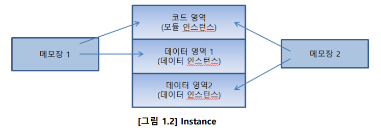

# . NET API

# **API 모듈**

**Gdi32.dll - 화면, 프린터, 메시지 관리**

**User32.dll -  사용자 인터페이스 관리 (이를 테면 커서, 아이콘, 스크랩 바 등등)**

# **Window의 특징**

- **이벤트 구동 방식(메시지 처리 방식)**
- **GUI 환경**
- **동적 연결**

# **핸들(Handle)**

**핸들은 객체에 기입된 고유한 값. 객체를 제어하기 위해서는 해당 객체의 핸들 값이 필요하다**

 **(포인터와 비슷한 제어방식인가?)**

**→ 포인터:메모리 주소를 저장하여 해당 위치의 데이터를 직접 액세스하고 조작할 수 있게 합니다.**

```cpp
int* ptr = new int; // 정수형 변수를 동적으로 할당
*ptr = 42;          // 값 할당
delete ptr;         // 사용 후 메모리 해제
```

**→핸들: 객체에 기입된 고유한 값. 객체를 제어하기 위해서는 해당 객체의 핸들 값이 필요하다**

**(핸들은 실제 메모리 주소를 노출하지 않을 수 있으며 리소스에 직접 액세스를 제공하지 않을 수 있습니다.)**

```cpp
// Windows API HANDLE을 사용한 예제
HANDLE hFile = CreateFile(...);
// hFile을 사용하여 파일 리소스를 다룸
CloseHandle(hFile); // 사용이 끝난 리소스를 해제
```

# **인스턴스(Instnace)**

- **프로그램은 명령들이 나열된 코드 영역(Code Segment)과 데이터를 보관하는 데이터 영
역(Data Segment)으로 구분된다.**

**→동일한 프로그램에 코드 영역까지 별도의 메모리를 할당하면 메모리만 낭비하게 된다.**

**(그렇다면 헤더파일 같은 느낌인가?)→ 그건 아닐거같지만.. 데이터라는걸 보니 사실상 객체겠구만 기래**

```cpp
// 클래스의 인스턴스를 생성하는 예
Car myCar; // myCar는 Car 클래스의 인스턴스입니다.
```



# **리소스 (Resource)**

**리소스란 메뉴, 아이콘, 커서, 비트맵 등 사용자 인터페이스를 구성하는 자원들의 정적 데
이터를 말한다.  → 안드로이드 스튜디오에서 사용하는 각 기능과 같은 컨트롤러로 보면 되겠군.**

# **WinMain**

**`WinMain`은 Windows 프로그램의 진입점(entry point) 함수 중 하나로, 주로 Windows API를 사용하여 GUI (그래픽 사용자 인터페이스) 애플리케이션을 개발할 때 사용됩니다**

```cpp
int WINAPI WinMain(HINSTANCE hInstance, HINSTANCE hPrevInstance, 
											LPSTR lpCmdLine, int nCmdShow)
```

## **각 인스턴스의 역할**

- **`hInstance`**: 현재 실행 중인 인스턴스의 핸들입니다. 이 핸들은 프로그램이 실행 중인 인스턴스를 식별하는 데 사용됩니다.
- **`hPrevInstance`**: 더 이상 사용되지 않으며 항상 **`NULL`**로 설정됩니다. 이전 인스턴스의 핸들을 나타냈습니다.
- **`lpCmdLine`**: 프로그램이 시작될 때 명령줄 매개변수입니다. 이를 통해 프로그램을 특정 방식으로 구성하거나 인자를 전달할 수 있습니다.
- **`nCmdShow`**: 윈도우를 어떻게 표시할 것인지를 지정하는 값입니다. 주로 **`SW_SHOWNORMAL`**, **`SW_MAXIMIZED`**, **`SW_MINIMIZED`** 등의 표시 상태를 설정하는 데 사용됩니다.


```cpp
//minwindef.h
#define WINAPI __stdcall
// WINAPI 지정자는 윈도우의 표준 호출 규약인 
//__stdcall을 사용한다는 의미 
```

# 함수 호출 규약

일반적으로 하나의 함수를 어떻게 컴파일 되도록 하느냐에 따른 호출 규약이 있다. 

 


# **핸들(Handle)**

**핸들(Handle)이란 객체에 붙여진 번호이며 문법적으로는 32비트(또는 64비트)의 의미없
는 정수값이다. 윈도우에서는 여러 가지 종류의 핸들이 사용되고 있다.
여러종류의 객체들이 존재하고(예를 들어 Pen, Brush, Window) 이들 객체를 제어하기 위
한 값이 필요한데 이를 핸들이라고 한다.
핸들의 특징은 아래와 같다.**

- **정수값이며, 사용목적은 객체를 구분하기 위함이다.
같은 종류의 핸들끼리는 절대로 중복된 값을 가지지 않는다. 물론 다른 종류의 핸들
끼리는 중복된 값을 가질 수도 있다.**
- **운영체제가 랜덤하게 발급해주는 정수값이다. 사용자는 발급된 정수값을 저장해 사
용하면 된다.
예를 들어 Pen을 만들면 운영체제가 Pen을 만들고 식별할 수 있는 핸들값을 생성하
여 리턴해준다. 사용자는 이 핸들을 잘 보관해 두었다가 해당 Pen을 제어할 때 사용
하면 된다.**
- **정수형이며, 그 실제값은 의미가 없다. 단순히 표식일 뿐이다.**
- **예외없이 모든 핸들은 접두어 H로 시작되며 핸들값을 저장하기 위해 별도의 데이터
형을 정의해 두고 있으며, 모두 부호없는 정수형이다.**


# **인스턴스(Instnace)**

**클래스를 정의하고 객체를 만들어 클래스의 멤버 함수를 호출함으로써 인스턴스를 다룰 수 있습니다.**

**프로그램은 명령들이 나열된 코드 영역(Code Segment)과 데이터를 보관하는 데이터 영
역(Data Segment)으로 구분된다.
동일한 프로그램에 코드 영역까지 별도의 메모리를 할당하면 메모리만 낭비하게 된다.
실제 메모리 상에 할당된 객체를 인스턴스라 하며 코드 영역에 대한 모듈인스턴스 데이
터 영역에 대한 데이터 인스턴스가 있다.
인스턴스라는 말은 클래스가 메모리에 실제로 구현된 실체를 의미한다. 윈도우용 프로그
램은 여러 개의 프로그램이 동시에 실행되는 멀티태스킹 시스템일 뿐만 아니라 하나의
프로그램이 여러 번 실행될 수 있다. 이 때 실행되고 있는 각각의 프로그램을 프로그램
인스턴스라고 하며 간단히 줄여서 인스턴스라고 한다. 예를 들어 메모장이 두 번 실행되**

**어 있다고 해 보자(그림 1.2참조)
이 때 두 프로그램은 모두 메모장이지만 운영체제는 각각 다른 메모리를 사용하는 다른
프로그램으로 인식한다. 이 때 각 메모장은 서로 다른 인스턴스 핸들을 가지며 운영체제
는 이 인스턴스 핸들값으로 두 개의 메모장을 서로 구별한다.**


```jsx
#pragma once
#include <Windows.h>

#include <tchar.h>

//#include "resource.h"

#include"handler.h"
#pragma comment (linker, "/subsystem:windows") // "/subsystem:console"
```

# **함수 호출 규약**


**__cdecl과
의 차이점은 호출된 함수가 스택에서 인자를 제거한다**

**`_cdecl`을 사용하면 호출자가 함수 호출 이후 스택을 정리해야 한다.**

**`_stdcall`을 사용하면 피호출자가 함수 호출 이후 스택을 정리해야 한다**

# **윈도우 생성 단계**


```jsx
#include <windows.h>
#include <tchar.h>
#define MAX_LOADSTRING 100
TCHAR szTitle[MAX_LOADSTRING] = _TEXT("First Sample"); // 제목 표시줄
TCHAR szWindowClass[MAX_LOADSTRING] = _TEXT("BIT"); // 기본 창 클래스
// 함수: MyRegisterClass()
// 목적: 윈도우 클래스 생성 및 등록
ATOM MyRegisterClass(HINSTANCE hInstance)
{
WNDCLASSEX wcex;
wcex.cbSize = sizeof(WNDCLASSEX);
wcex.style = CS_HREDRAW | CS_VREDRAW;
wcex.lpfnWndProc = DefWindowProc;
wcex.cbClsExtra = 0;

 23
wcex.cbWndExtra = 0;
wcex.hInstance = hInstance;
wcex.hIcon = LoadIcon(NULL, IDI_APPLICATION);
wcex.hCursor = LoadCursor(NULL, IDC_ARROW);
wcex.hbrBackground = (HBRUSH)(COLOR_WINDOW+1);
wcex.lpszMenuName = 0;
wcex.lpszClassName = szWindowClass;
wcex.hIconSm = 0;
return RegisterClassEx(&wcex);
}
// 함수: InitInstance(HINSTANCE, int)
// 목적: 윈도우 창을 만들고 핸들을 리턴
HWND InitInstance(HINSTANCE hInstance, int nCmdShow)
{
 HWND hWnd;
 hWnd = CreateWindow( szWindowClass, szTitle, WS_OVERLAPPEDWINDOW,
 CW_USEDEFAULT, 0, CW_USEDEFAULT, 0, NULL, NULL, hInstance, NULL);
 if (!hWnd) {
 return 0;
 }
 ShowWindow(hWnd, nCmdShow);
 UpdateWindow(hWnd);
 return hWnd;
}
int WINAPI _tWinMain(HINSTANCE hInst, HINSTANCE hPrev, LPTSTR lpCmdLine, int nShowCmd)
{
//1,2 윈도우 클래스 생성 및 등록
24
MyRegisterClass(hInst);
//3,4 윈도우 생성 및 화면 출력
HWND hwnd = InitInstance (hInst, nShowCmd);
if (hwnd == 0)
{
return FALSE;
}
MessageBox(0, TEXT("Hello,API"),TEXT("First"), MB_OK);
return 0;
}
```

# **윈도우 핸들**

**윈도우 핸들 얻기** 

```jsx
FindWindow(LPCTSTR lpCalssName, LPCTSTR lpWindowName);
```

**윈도우 클래스 정보**

- **시스템 전역 클래스(System global class)
운영체제가 부팅될 때 등록되며 주로 컨트롤을 만들 때 사용된다.
Button, edit, scrollbar, listbox, 등이 그 예이며, 따라서 버튼 윈도우를 만들고 싶다
면 등록된 “button”이라는 클래스명으로 참조해서 생성하면 된다.**
- **응용 프로그램 전역 클래스(Application global class)
주로 DLL에 의해 등록되며 다른 프로그램에서 사용 될 수 있다.
뒤에서 보게 될 공통 컨트롤들이 이에 해당되며, 해당 클래스정보는 comctl32.dll 에
저장되어 있다.**
- **응용 프로그램 로컬 클래스(Application local class)
응용 프로그램 자신이 메인 윈도우나 차일드 또는 커스텀 컨트롤을 만들기 위해 프
로그램 상단에 등록하는 클래스이며 해당 프로그램이 종료되면 윈도우 클래스도 같
이 파괴된다.
등록된 곳에서만 사용할 수 있다.**

# **윈도우 객체(Window Object)**

**윈도우 객체는 운영체제가 하나의 윈도우를 관리하기 위해 생성하는 데이터 구조체이다.**


**createWindow()의 경우 윈도우 오브잭트를 생성하고 showWindow의 경우 생성된 윈도우 오브잭트 정보를 바탕으로 화면에 윈도우를 출력해준다.**

**GetWindowLongPtr() 함수는 저장된 윈도우 오브젝트에서 원하는 정보를 얻을 수 있고, S
etWindowLongPtr() 함수는 저장된 윈도우 오브젝트 정보를 수정할 수 있다. 접근 가능한
정보는 아래 표와 같다.**

# **윈도우 프로시저**

**윈도우가 이전 운영체제인 도스와 구분되는 가장 큰 차이점은 메시지 기반의 운영체제라
는 점이다. 윈도우에서 실행되는 응용 프로그램은 사용자 입력을 받기 위해 함수를 직접
적으로 호출하는 경우가 없으며 시스템이 보내는 메시지를 기다릴 뿐이다.**

**LRESULT CALLBACK WndProc(HWND hWNd, UINT iMessage,
WPARAM, wParam, LPARAM lParam)**


**윈도우 프로시저는 이 함수로 전달되는 무수히 많은 메시지들을 처리하므로 거대한 switc
h 문으로 구성된다. 처리하는 메시지가 많으면 많을수록 case 문이 많아질 것이며, 처리
하지 않는 메시지는 반드시 DefWindowProc 으로 전달해야 한다**

**일반적으로 처리된 메시지 결과로 0을 리턴한다.**

# **메지지 큐**

**메시지는 크게 메시지 큐로 들어가는 큐 메시지와 메시지 큐에 들어가지 않고 곧바로 윈
도우 프로시저로 보내지는 비큐메시지로 구분된다**

**비큐 메시지 : 비큐 메시지는 윈도우에게 특정 사실을 알리거나 명령을 내리기 위해 큐를 통하지 않고
바로 윈도우 프로시저로 보내지는 메시지이다.**


**(1) 사용자가 윈도우를 만들기 위해 CreateWindowEx API를 호출하면 윈도우가 만들어
지고
(2) 윈도우가 만들어졌다는 사실을 사용자에게 알리기 위해 WM_CREATE 라는 메시지가
메시지 처리 함수에 전달된다.
(3) WM_CREATE 메시지 처리가 완료되면 CreateWindowEx 함수는 윈도우 핸들을 리턴
한다.
즉, WM_CREATE 메시지는 메시지 큐에 놓이지 않고 직접 윈도우 프로시져에 전달된다. (
이 떄 사용된 함수가 SendMessage 이다.) 이를 비큐 메시지라고 한다.**


**큐 메시지 :  마우스 키보드 메시지들은 직접 윈도우 프로시저로 전달되지 않고 메시지 큐에 놓이게
되는 데 이를 큐 메시지라고 한다**


**메시지 처리 함수에서 발생된 메시지를 처리하지 않은 경우 반드시 아래 함수로 보내서
default 처리가 되게 해야 한다**

**LRESULT CALLBACK DefWindowProc(HWND hwnd, UINT message,
WPARAM wParam, LPARAM lParam)**

**해당 함수 호출시 인자는 윈도우 프로시저에 전달된 인자를 그대로 전달한다.**

**스켈레톤 코드** 

```cpp
#include <windows.h>
#include <tchar.h>
LRESULT CALLBACK WndProc( HWND hwnd, UINT msg, WPARAM wParam, LPARAM lParam)
{
switch( msg ) {
 case WM_CREATE:
 return 0;
case WM_DESTROY:
PostQuitMessage(0);
return 0;
}
return DefWindowProc(hwnd, msg, wParam, lParam);
}
int WINAPI _tWinMain(HINSTANCE hInst, HINSTANCE hPrev, LPTSTR lpCmdLine, 
int nShowCmd)
{
// 1. 윈도우 클래스 만들기
WNDCLASS wc;
wc.cbWndExtra = 0;
wc.cbClsExtra = 0;
wc.hbrBackground = (HBRUSH)GetStockObject(WHITE_BRUSH);
wc.hCursor = LoadCursor(0, IDC_ARROW);
 
wc.hIcon = LoadIcon(0, IDI_APPLICATION);
wc.hInstance = hInst;
wc.lpfnWndProc = WndProc;
wc.lpszClassName = TEXT("First");
wc.lpszMenuName = 0;
wc.style = 0;
// 2. 등록(레지스트리에)
RegisterClass(&wc);
// 3. 윈도우 창 만들기
HWND hwnd = CreateWindowEx( 0, // WS_EX_TOPMOST
TEXT("first"), // 클래스 명
TEXT("Hello"), // 캡션바 내용
WS_OVERLAPPEDWINDOW, 
CW_USEDEFAULT , 0, CW_USEDEFAULT, 0,// 초기 위치
0, 0, // 부모 윈도우 핸들, 메뉴 핸들
hInst, // WinMain의 1번째 파라미터 (exe 주소)
0); // 생성 인자
// 4. 윈도우 보여주기
ShowWindow(hwnd, SW_SHOW);
UpdateWindow(hwnd);
// 5. Message 
MSG msg;
while( GetMessage( &msg, 0, 0, 0 ) )
{
TranslateMessage(&msg);
DispatchMessage(&msg);
}
return 0;
}
```

# **PEEKMESSAGE**

**메시지 루프에서 제일 중요한 함수는 메시지를 가져 오는 GetMessage함수이다. 이 함수
는 스레드 메시지 큐에서 메시지를 가져오는데 메시지가 없으면 새로운 메시지가 전달될
때까지 리턴하지 않는다. 즉 메시지가 없을 경우 무한 대기한다.**

**만약, 메시지 큐에 메시지가 없을 경우 다른 작업을 하고 싶다면(유휴 시간) 가능할까?
그것을 가능케 하는 함수가 PeekMessage API 이다.
BOOL PeekMessage(LPMSG lpMsg, HWND hwnd, UINT wMsgFilterMin, UINT wMsgFilterMax, UINT wRemoveMsg);**

**이 함수는 메시지 큐에서 메시지를 꺼내거나 검사하되 메시지가 없더라도 즉각 리턴한다.
리턴값이 TRUE 이면 메시지가 있다는 뜻이고, FALSE 이면 메시지가 없다는 뜻이다.
wRemoveMsg 는 메시지가 있을 경우 이 메시지를 큐에서 제거할 것인지 아닌지를 지정
하는 데 PM_REMOVE 이면 큐에서 메시지를 제거하고, PM_NOREMOVE 이면 제거하지
않을 수도 있다.**

```cpp
// 5. Message 
MSG msg;
while(true)
{
if( PeekMessage( &msg, 0, 0, 0, PM_REMOVE ) )
{
if( msg.message == WM_QUIT) break;
TranslateMessage(&msg);
DispatchMessage(&msg);
}
else
{
HDC hdc = GetDC(hwnd);
SetPixel(hdc, rand()%500, rand()%400, RGB(rand()%256, rand()%256, rand()%256));
ReleaseDC(hwnd, hdc);
 
}
}
```

# **사용자 정의 메시지**

**응용 프로그램은 시스템이 정의한 메시지 외에 자신의 필요에 따라 고유의 메시지를 만
들어 사용할 수 있다. 메시지는 약속이기 때문에 정하기 나름이며 wParam, lParam 의 용
도도 편한대로 정해 사용할 수 있다.**

**사용자 정의 메시지를 사용하기 위해서는 다음과 같은 절차를 거친다.**

1. **나만의 메시지를 정의한다.**
2. **메시지 프로시저에서 해당 메시지를 필터링한다.**
3. **원하는 시점에서 SendMessage 를 사용하여 사용자 정의 메시지를 호출한다.**

**즉 ,sendmessage를 통해 내가 원하는 시점에 호출하여 사용할 수 있다.** 

```cpp
#include <windows.h>
#include <tchar.h>
#define WM_MYMESSAGE WM_USER+100
LRESULT CALLBACK WndProc( HWND hwnd, UINT msg, WPARAM wParam, LPARAM lParam)
{
switch( msg )
{
case WM_MYMESSAGE:
{
TCHAR buf[20];
wsprintf(buf, TEXT("%d+%d=%d"), wParam, lParam, wParam+lParam);
MessageBox(hwnd, buf, TEXT(""), MB_OK);
 
}
return 0;
case WM_LBUTTONDOWN:
SendMessage(hwnd, WM_MYMESSAGE, 10, 20);
return 0;
 case WM_CREATE:
 return 0;
case WM_DESTROY:
PostQuitMessage(0);
return 0;
}
return DefWindowProc(hwnd, msg, wParam, lParam);
}
```

**사용자 정의 메시지는 윈도우끼리 메시지 통신 또한 가능하다. 다른 프로그램과 통신하는
예를 확인해 보자.**

**전송 1.cpp**

```cpp
#include <Windows.h>
#include <stdio.h>
#define WM_MYMESSAGE WM_USER+100
void main()
{
HWND hwnd = FindWindow(0, TEXT("Hello"));
int value = SendMessage(hwnd, WM_MYMESSAGE, 10, 20);
printf("%d\n", value);
}
```

**전송2.cpp**

```cpp
#define WM_MYMESSAGE WM_USER+100
LRESULT CALLBACK WndProc( HWND hwnd, UINT msg, WPARAM wParam, LPARAM lParam)
{
switch( msg )
{
case WM_MYMESSAGE:
{
TCHAR buf[20];
wsprintf(buf, TEXT("%d+%d=%d"), wParam, lParam, wParam+lParam);
MessageBox(hwnd, buf, TEXT(""), MB_OK);
}
return wParam + lParam;
case WM_DESTROY:
PostQuitMessage(0);
return 0;
}
return DefWindowProc(hwnd, msg, wParam, lParam);
}
```

**SendMessage는 호출 후 상대방이 리턴하기 전까지 리턴하지 못한다. 따라서 호
출 한 프로그램은 상대방이 메시지박스를 닫기 전까지는 프로그램이 진행되지
못한다.
메시지 박스를 종료하면 리턴값이 호출한 프로그램 쪽으로 전달되게 된다.
다음은 동일한 API 프로그램을 PostMessage로 호출한 예이다. PostMessage는
SendMessage와는 달리 상대방 큐에 메시지를 넣는다. 따라서 큐에 넣고 바로
리턴하기 때문에 리턴 값은 성공과 실패 여부의 BOOL 형 값을 갖는다.**

```cpp
#include <Windows.h>
#include <stdio.h>
#define WM_MYMESSAGE WM_USER+100
void main()
{
HWND hwnd = FindWindow(0, TEXT("Hello"));
BOOL b = PostMessage(hwnd, WM_MYMESSAGE, 10, 20);
if( b == true)
{
printf("전송 되었습니다.\n");
}
printf("프로그램을 종료합니다.\n");
}
```

# **DC**

**DC란 출력에 필요한 모든 정보를 가지는 구조체이며 GDI 모듈에 의해 관리된다. 문자열
의 모양을 지정하는 폰트, 선의 색상과 굵기, 채움 무늬와 색상, 그리기 모드 등등이 모두
출력에 필요한 정보들이다.**


**클라이언트 DC 얻기**

**HDC GetDC(HWND hWnd);**

**바탕화면 DC 얻기**

**HDC hdc = GetDC(0);
HDC hdc = CreateDC(“DISPLAY”, 0, 0, 0);**

## **무효화 영역→ 다시 그려져야 하는 영역**


**—> 무효화 영역이 발생하면 운영체제는 WM_PAINT 메시지를 해당 윈도우 프로시저에게 보낸다.** 

**WM_PAINT 메시지 루틴에서 클라이언트 DC를 얻고 사용할 수 있는 방법** 

**HDC BeginPaint(HWND hwnd, LPPAINTSTRUCT lpPaint);
BOOL EndPaint(HWND hWnd, CONST PAINTSTRUCT *lpPaint);**

**case WM_PAINT:
return 0;  —> 이렇게 사용하게 되면 무효화 영역이 유효화 되지 않으므로 WM_PAINT가 무한반복 됨**

**InvalidateRect(hwnd, 0, FALSE) —> 무효화 영역을 만들고 지우지 않는 이유?** 

**⇒ 이전에 그렸던 것을 다시 지우지 않는다 !** 

**즉, TRUE 로 설정하게 된다면?** 


**GDI 객체의 기본적인 사용 방법**

```cpp
PAINTSTRUCT ps;
HDC hdc = BeginPaint(hwnd, &ps);
HBRUSH brush = (HBRUSH)GetStockObject(GRAY_BRUSH);
HBRUSH old = (HBRUSH)SelectObject(hdc, brush);
Rectangle(hdc, 10,10,100,100);
SelectObject(hdc, old);
EndPaint(hwnd, &ps);
```

**윈도우의 좌표 체계** 

- **논리좌표 : 대부분의 GDI 함수가 사용하는 좌표**
- **장치좌표 : 비 GDI가 사용하는 좌표 메시지의 피라메터로 들어오는 좌표 
(클라이언트 좌표, 윈도우 좌표 , 스크린 좌표 )**

# **마우스 관련 정보**

**클라이언트 영역: 사용자로부터 마우스, 키보드 입력을 받고 사용자에게 출력을 보여
주기 위한 영역**

**논클라이언트 영역  : Client 이외의 영역 캡션바, 메뉴, 최대화, 최소화, 닫기버튼, 스크롤바, 상태바 등으로 구성된다.**

**마우스 이벤트 발생 시 LPARAM 엔느 마우스 메시지 좌표가 들어가 있다.** 

**→ 상위 16비트에는 X 좌표가 , 하위 16비트에는 Y 좌표가 있다.**


**HIT TEST CODE** 

**해당 메시지는 현재 커서가 어느 윈도우부분에 있는지 알려주는 상수이다.** 

**→ WM_NCHITTEST 메시지가 DefWindowProc()으로 전달될 때 이 코드가 리턴 된다.**

**마우스 캡쳐** 

**특정 윈도우가 SetCapture함수를 사용해서 마우스를 캡쳐할 경우 , 모든 마우스 메시지는 캡쳐한 윈도우에게 전달된다.** 


**—> 마우스 캡쳐가 되어 있을 경우 WM_NCHITTEST , WM_SETCURSOR 메시지는 발생되지 않음.**

**키보드 메시지** 

**키보드로 부터 입력이 발생했을 경우 윈도우는 포커스를 가진 프로그램에게 키보드 메시지 WM_CHAR, WM_KEYDOWN 등 을 보내주며 프로그램은 이 메시지를 받아 입력을 처리한다.**


**→ 발생한 스캔 코드는 키보드 디바이스 드라이버를 거쳐 시스템에서 발생하는 모든 메시지를 담는 SYSTEM MESSAGE QUEUE 에 저장된다.**  

**—> 저장된 메시지는 모든 애플리케이션이 독립적으로 가지고 있는 메세지 큐에 전달되고 API 코드에서 작성된 메시지 루프에서 해당 메시지를 읽어 프로시저에 최종 전달되게 됩니다.**


**스캔 코드와 가상 키 코드 값은 대소문자가 동일하다는 것을 볼 수 있다.**

**스캔 코드 값은 LPARAM 의 16~23 비트에 있다.**

**BOOL TranslateMessage(const MSG *lpMsg);**

**만약 WM_KEYDOWN 메시지를 위의 함수로 전달하면 위 함수가 WM_CHAR 메시지를 생성해주어 메시지 루프에 작성한다.**


# **시간정보 획득하기**


**UNIT SetTimer(HWND hWnd, UINT nIDEvent, UINT uElapse,
TIMERPROC lpTimerFunc); → 타이머를 생성**

**KillTimer( HWND hWnd, UINT uIDEvent ) → 타이머를 종료**

# **비트맵**

**비트맵이란 이미지를 저장하고 있는 그래픽 오브잭트이다. 미리 그려진 그림의 각 픽셀 색상과 기타 이미지의 크기 , 해상도 정보를 가지고 있는 이미지 데이터의 덩어리이다.**


**모니터 화면에서 나오는 것들은 결국 비디오 메모리에 있는 BIT 들이다. 결국 비디오 메모리를 하나의 비트맵으로 생각할 수 있다. → 아래의 함수는 비디오 메모리의 특정 영역에 있는 데이터를 다른 영역에 옮길때 사용한다.** 

```cpp
hdcDisplay = CreateDC(TEXT("DISPLAY"), 0,0,0);
hdcClient = BeginPaint( hwnd, &ps);
BitBlt( hdcClient, 0, 0, cxClient, cyClient,
hdcDisplay, 0, 0, SRCCOPY);
DeleteDC( hdcDisplay );
106
EndPaint( hwnd, &ps );
```

**→ 아래의 함수로 크기를 조절ㄹ할 수 있다.**

```cpp
POINT pt;
GetCursorPos( &pt);
hdcDisplay = CreateDC(TEXT("DISPLAY"), 0,0,0);
hdcClient = GetDC( hwnd);
StretchBlt( hdcClient, 0, 0, cxClient, cyClient,
hdcDisplay, pt.x, pt.y, 100, 100,
108
SRCCOPY);
DeleteDC( hdcDisplay );
ReleaseDC( hwnd, hdcClient );
```

**비트 맵 포멧의 종류** 

- **DDB : 이미지의 크기와 색상에 관한 기본적인 정보와 그리고 이미지 데이터만으로 구성되ㅓ어 있기에 해상도의 장치에 광범위하게 사용되지 못하여 만들어진 장치 외의 다른 장치에서 출력하면 제대로 출력하지 못하는 경우가 있다.**
- **DIB : 포멧의 비트맵은 장치에 독립적이기에 제 모양되로 출력될 수 있다.**


# **리소스 다루기**

**프로그램은 코드와 데이터로 구성된다. 데이터는 프로그램의 처리 대상이며 코드는 데이
터를 처리하는 수단이다. 데이터의 의미를 확장하여 코드가 아닌 모든 것을 데이터라고
할 때 비트맵, 아이콘, 메뉴, 문자열 등등 프로그램의 논리와 무관한 모든 것들이 데이터
에 속한다. 이런 리소스들은 별도의 편집기로 만들어져 컴파일시에 실행파일에 결합된다.**

**종류 : 아이콘 , 커서 , 메뉴 메인 메뉴 등이 있으며 우리는 이를 ID 를 통해 제어할 수 있다.**

# **컨트롤**

**컨트롤이란, 사용자와의 인터페이스를 이루는 도구이다. 인터페이스를 이룬다는 말은 사
용자로부터 명령과 입력을 받아들이고 출력 결과를 보여준다는 뜻이다.**


**컨트롤을 생성하기 위해 필요한 것 : 컨트롤의 ID, 컨트롤의 핸들** 

**일반적으로 컨트롤의 ID는 통지 메시지를 수신할때 (자식이 부모에게 전달하는 메시지)를 사용하며 , 핸들은 부모가 컨트롤에게 메시지를 전달할 때 사용한다.**

```cpp
hEdit = CreateWindow( TEXT("Edit"), TEXT(""),
WS_CHILD | WS_VISIBLE | WS_BORDER,
10,10,90,20, hwnd, (HMENU)IDC_EDIT, 0,0);
hBtn = CreateWindow( TEXT("button"), TEXT("Push"),
WS_CHILD | WS_VISIBLE | WS_BORDER ,
10,40,90,20, hwnd, (HMENU)IDC_BUTTON, 0,0);
```

**이러한 방법도 있지만 리소스를 통해 핸들을 얻어 제어할 수 있다.**

→ 통지 메시지의 처리 

```cpp
GetWindowText( hEdit, s, 256); // Edit 에서 값을 얻는다.
SetWindowText( hwnd, s); // 부모 윈도우의 캡션을 변경한다.
```

컨트롤(자식 윈도우)의 원리 

컨트롤은 윈도우를 만들때 정의된다. → 부모 클라이언트 영역에서 자식에게 메시지를 전달하면서 수행 

# 서브 클래싱

서브 클래싱이란 윈도우 프로시저로 보내지는 메시지를 중간에 가로채는 기법이다. 

→ 중간 메시지를 조작하면서 윈도우 모양을 변경하거나 동작을 감시한다. 

# 공통 컨트롤

공통 컨트롤은 윈도우즈 95 이후에 추가된 컨트롤을 의미하며 개념 및 일반적 사용방법
은 표준 컨트롤과 동일하다.
표준 컨트로과는 약간의 차이점이 있는데 표준 컨트롤은 시스템에 내장되어 있기 때문에
언제든지 사용가능하다. 그러나 공통 컨트롤들은 DLL 에 의해 제공되기 때문에 이 DLL

 
이 로드되어 있지 않으면 윈도우 클래스가 정의되지 않으며 따라서 컨트롤을 생성할 수
가 없다. 그래서 공통 컨트롤을 사용하기 위해서는 아래의 초기화 작업이 필요하다.

1. CommonCtrl.h 를 포함시킨다.
2. WM_CREATE 에서 InitCommonControls(Ex) 함수를 호출해 준다.
3. ComCtl32.lib 를 링크시킨다. 아래 전처리 문으로도 가능하다.
#pragma comment(lib "comctrl32.lib")