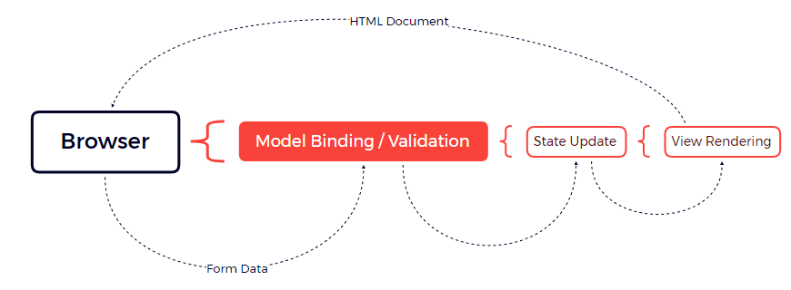

# Asp.NET Core  Blazor Server

# Blazor

**Blazor**는 **Web** 애플리케이션에서 Client-side 상호작용을 추가할 수 있는 기술로, Blazor Server와 Blazor WebAssembly 두 가지 방식이 있다.
이전 예제에서는 [ASP.NET](http://asp.net/) **Core MVC**와 **Razor Page**를 사용하여 단일 페이지를 구현했지만, 이는 실제 **Blazor**가 아니다.
실제 Blazor는 다중 Razor Component 기반으로 동작하며, 각 컴포넌트의 상태(State) 변경 시 해당 컴포넌트만 업데이트하는 방식으로, React와 유사한 컴포넌트 단위 렌더링을 제공한다.

## Blazor Server의 이해

이전 예제를 실행하여 “Manufacturer”를 선택하고 전송 시 Application에서는 Browser는 Controller나  Razor Page를 사용하는 것에 따라 action method나  handler method에서 전달받는 form을 submit 하는 HTTP GET 요청을 전송하며 action 이나 handler 에서는 선택하는 데이터를 반영하는 새로운 HTML 문서를 Browser로 전송하는 View를 랜더링하는 과정을 거치게 된다.

Browswer→ action → Model Binding / Validation → State Update → View Rendering

- 단일 Razor 페이지   예제



위 동작은 직관적이나 비효율적이다. 그 이유는 Form 에 대한 액션 마다  새로운 HTTP 요청을 ASP .NET CORE로 전송하는데 이때 , 각 요청은  각 HTML 전체 문서를 로딩하는 방식이다.

Blazor의 경우 HTML 문서는 처음 진입점에만 제공되고  Javascript 코드가 실행될 떄 Server로 HTTP 연결을 다시 열어두어 사용자의  상호작용을 준비하게 한다. 웹 소켓 방식같지만 웹소켓은 사실 비연결 지향이지만   

연결지향으로 통신하여 상태 관리를 해준다.

예를 들어 사용자가 Select 요소에서 값을 선택하게 되면 선택한 세부 사항이 Server로 전송되고 기존 HTML에 적용할 변경사항만을 응답받는 방식이다. 


**(1) Blazor Server의 장점**

Blazor의 가장 큰 매력은 C#으로 작성된 Razor Page에 기반한다는 것입니다. 이 것은 Angular나 React와 같은 새로운 framework를 배우지 않고 또한 TypeScript나 JavaScript와 같은 새로운 언어를 배우지 않고도 높은 수준의 효율성과 반응성을 가진 Application을 개발할 수 있게 합니다. Blazor는 ASP.NET Core의 나머지 부분과 잘 통합되었으며 이전에 설명된 기능을 기반으로 하므로 쉽게 사용할 수 있습니다.(특히 어지러울 정도로 급격한 학습 곡선을 가진 Angular와 같은 framework와 비교해서는 더욱 그렇습니다.)

**(2) Blazor Server의 단점**

Blazor는 지속적 HTTP 연결을 구축하고 관리하기 위해 최신의 Browser를 필요로 하며 이러한 연결성 때문에 Blazor를 사용하는 application은 연결을 잃게 되면 작동을 중지하게 되므로 offline사용에는 적합하지 않습니다. 또한 동작방식에 대한 특징 때문에 연결성을 신뢰할 수 없고 연결 속도가 느릴 수 있습니다. 이러한 문제는 WebAssembly를 통해 극복할 수 있지만 나름대로의 한계점을 여전히 가지고 있습니다.

**(3) Blazor와 Angular/React/Vue.js의 선택**

Blazor와 JavaScript framework중에서의 선택은 개발자의 경험과 사용자의 예상되는 연결성에 의해 결정될 수 있습니다. JavaScript에 대한 경험이 없거나 JavaScript framework를 사용해 본 적이 없다면 Blazor를 선택할 수 있지만 안정된 연결성과 최신의 Browser가 사용되어야 함을 감안해야 합니다. 따라서 Blazor는 network 품질을 사전에 결정할 수 있는 LOB(Line-of-business) Application에 적합합니다.

아니면 JavaScript에 대한 경험이 있고 공개 Application을 만드는 경우라면 이때는 network 품질이나 사용되는 Browser를 사전에 판단할 수 없으므로 대신 JavaScript framework를 사용할 수 있습니다.(어떤 framework를 선택하느냐는 중요한 문제가 아닙니다. Angular나 React, Vue.js는 모두 훌륭한 framework이며 각각의 framework를 사용해 간단한 app을 만들어 보고 이 중에서 당신에게 가장 적합하다고 판단되는 개발 model을 가진 framework를 선택하면 됩니다.)

공개 application을 만들지만 JavaScript에 대한 경험이 없다면 2가 선택사항이 생길 수 있습니다. 가장 안전한 option은 지금까지 설명된 ASP.NET Core 기능의 사용을 고수하고 이것이 가져오는 비효휼성을 받아들이는 것입니다. 그다지 나쁜 선택은 아니며 여전히 고품질의 application을 개발할 수 있습니다. 좀 더 다른 선택은 TypeScript나 JavaScript를 배우고 Angular나 React, Vue.js 중 하나를 학습하는 것이지만 JavaScript를 master 하는 데 걸리는 시간과 들여야 하는 노력이 필요합니다.

Blazor를 사용하기 이전에 몇가지 준비사항이 필요합니다. 우선 아래와 같이 project의 Program.cs에서 필요한 service와 middleware를 추가해야 합니다.

- program.cs

```csharp
builder.Services.AddControllersWithViews();
builder.Services.AddRazorPages();
builder.Services.AddServerSideBlazor();

builder.Services.AddDbContext<NorthwindContext>(opts => {
	opts.UseSqlServer(builder.Configuration["ConnectionStrings:NorthwindConnection"]);
	opts.EnableSensitiveDataLogging(true);
});

var app = builder.Build();

//app.MapGet("/", () => "Hello World!");

app.UseStaticFiles();
app.MapControllers();
app.MapControllerRoute("controllers", "controllers/{controller=Home}/{action=Index}/{id?}");
app.MapRazorPages();
app.MapBlazorHub();
```

기존과 같이 Program.cs 에서 Service 계층을 연결해준다.

  

Blazor에서 presistent HTTP 요청을 처리하는 방식은 ASP .NET CORE의 일부인  SignalR과 관련이 있다 

## (1) SIgnalR [ASP의 연결형 방식]

[ASP.NET](http://asp.net/) SignalR은 애플리케이션에 실시간 웹 기능을 추가하는 프로세스를 간소화하는 [ASP.NET](http://asp.net/) 개발자를 위한 라이브러리이며, 실시간 웹 기능은  서버에서 클라이언트가 새 데이터를 요청할 때까지 기다리지 않고 서버코드가 연결 된 클라이언트에 콘텐츠를 즉시 푸시하도록 하는 기능이다.


SignalR은 MVC로 클라이언트 측 자바스크립트 방식을 통해  클라이언트 측이 Form Submit 시 서버에서 요청에 맞는 데이터를 전송해주는 반면, SignalR의 경우 클라이언트와 서버 사이에 지속적인 연결을만들고 서버가 필요할 때  바로 데이터를 푸시하는 방식이다. 이 방식을 통해 서버가 상태 변화를 감지 및 계산하는 것이고 SIgnalR이 전달하며  양방향으로 송신하며 DOM을 실시간으로 구성해주는 역할을 한다.

SignalR을 사용하기 위해  Controller view에 사용되는 Views/Shared의 _Layout.cshtml 에  Blazor.server.js를 추가한다

```csharp
<!DOCTYPE html>
<html>
<head>
	<title>@ViewBag.Title</title>
	<link href="/lib/bootstrap/css/bootstrap.min.css" rel="stylesheet" />
	<base href="~/" />

</head>
<body>
	<div class="m-2">
		@RenderBody()
	</div>
	<script src="_framework/blazor.server.js"></script>
</body>
</html>
```

**● Blazor Imports File 생성**

Blazor는 사용할 namespace를 지정하기 위해서는 자체 import file이 필요합니다. project에 해당 file를 추가하는 것은 잊어버리기 쉽지만 실제 file을 import해주지 않으면 Blazor는 작동하지 않을 것입니다. project에 _Imports.razor file을 아래와 같이 추가합니다.(Visual Studio에서는 file을 생성하기 위해 Razor View imports template을 사용할 수 있지만 file의 확장자는 반드시 .razor여야 합니다.)

```csharp
@using Microsoft.AspNetCore.Components
@using Microsoft.AspNetCore.Components.Forms
@using Microsoft.AspNetCore.Components.Routing
@using Microsoft.AspNetCore.Components.Web
@using Microsoft.JSInterop
@using Microsoft.EntityFrameworkCore
@using MyBlazorApp.Models
```

예제에서 처음 5개 @using표현식은 Blazor에서 필요한 namespace에 해당합니다. 그리고 나머지 2개 표현식은 예제에서의 편의를 위한 것인데 Entity Framework Core와 Models namespace내부의 class를 기본적으로 사용할 수 있도록 하는 것입니다.

 

## **(2) Razor Component 생성방식**

기술 자체는 Blazor이지만 핵심 구성 요소는 Razor Component라고 합니다. Razor Component는 .razor라는 확장자를 가진 file을 통해 정의되며 file명 자체는 대문자로 시작되어야 합니다. Component는 어느 위치에든 정의될 수 있으나 한 곳에서 모아지는 형태로 정의되어 project구조가 잘 정리되도록 하는 것이 일반적입니다. project의 Advenced folder안에 Blazor folder를 생성하고 ProductList.razor이름의 Razor component를 아래와 같이 추가합니다. 

- Blazor Component 방식

```csharp
<table class="table table-sm table-bordered table-striped">
	<thead>
		<tr>
			<th>ID</th>
			<th>Name (Price)</th>
			<th>Category</th>
			<th>Manufacturer</th>
		</tr>
	</thead>
	<tbody>
		@foreach (Product p in Product ?? Enumerable.Empty<Product>())
		{
			<tr class="@GetClass(p.ProductManufacturer?.ManufacturerName)">
				<td>@p.ProductId</td>
				<td>@p.ProductName, @p.ProductPrice?.ToString("#,##0")</td>
				<td>@p.ProductCategory.CategoryName</td>
				<td>@p.ProductManufacturer?.ManufacturerName</td>
			</tr>
		}
	</tbody>
</table>

<form asp-action="Index" method="get">
	<div class="form-group">
		<label for="selectedManufacturer">Manufacturer</label>
		<select name="selectedManufacturer" class="form-control" @bind="SelectedManufacturer">
			<option disabled selected>Select Manufacturer</option>
			@foreach (string Manufacturer in Manufacturer ?? Enumerable.Empty<string>())
			{
				<option value="@Manufacturer" selected="@(Manufacturer == SelectedManufacturer)">
					@Manufacturer
				</option>
			}
		</select>
	</div>
	<button class="btn btn-primary mt-2" type="submit">Select</button>
</form>

@code {
	[Inject]
	public BlazorTDBContext? Context { get; set; }

	public IEnumerable<Product>? Product => Context?.Product.Include(p => p.ProductCategory).Include(p => p.ProductManufacturer);
	public IEnumerable<string>? Manufacturer => Context?.Manufacturer.Select(m => m.ManufacturerName);
	public string SelectedManufacturer { get; set; } = string.Empty;
	public string GetClass(string? Manufacturer) => SelectedManufacturer == Manufacturer ? "bg-info text-white" : "";
}
```

Razor 컴포넌트 RazorPage와 비슷한 구조를 가지는데  View 영역은  컴포넌트의 HTML 만으로 data 값을 넣거나 다음과 같이 객체를  생성하기 위한 @표현식으로  Razor 기능에 의존한다.

```csharp
@foreach (string Manufacturer in Model?.Manufacturer ?? Enumerable.Empty<string>())
{
	<option selected="@(Manufacturer == Model?.SelectedManufacturer)">
		@Manufacturer
	</option>
}
```

@foreach 표현방식 또한  Manufacturer Enum 배열에 대한 값의 option 요소를 생성하는 방식도 Controller나 Razor Page 에서 생성하였던것들과 다를 것이 없다.

- Razor 컴포넌트의 사용방식
    
    ```csharp
    <h4 class="bg-primary text-white text-center p-2">Product</h4>
    
    <component type="typeof(MyBlazorApp.Advanced.Blazor.ProductList)" render-mode="Server" />
    ```
    
- ASP MVC 기본  Controller 방식

```csharp
// HomeController.cs
using AspNetCoreBlazorEmpty.Models;
using Microsoft.AspNetCore.Mvc;
using Microsoft.EntityFrameworkCore;
 
using System;
using System.Diagnostics;

namespace AspNetCoreBlazorEmpty.Controllers
{
    // {}Controller 로 작명시  : Controller를 상속받은 클래스는 
    public class HomeController : Controller
    {
        private BlazorTDBContext context;
        public HomeController(BlazorTDBContext dbContext)
        {
            context = dbContext;
        }
        public IActionResult Index([FromQuery] string selectedManufacturer)
        {
            return View(new ProductListViewModel
            {
                // 초기진입시 모든 product
                Product = context.Products.Include(p => p.ProductCategory).Include(p => p.ProductManufacturer),
                Manufacturer = context.Manufacturers.Select(m => m.ManufacturerName).Distinct(),
                SelectedManufacturer = selectedManufacturer
            });
        }
    }
  // View Model
    public class ProductListViewModel
    {
        public IEnumerable<Product> Product { get; set; } = Enumerable.Empty<Product>();
        public IEnumerable<string> Manufacturer { get; set; } = Enumerable.Empty<string>();
        public string SelectedManufacturer { get; set; } = String.Empty;
        public string GetClass(string Manufacturer) {
            Debug.Print($"Selected 값:{SelectedManufacturer},들어온 Manufacture 값{Manufacturer} ");
            Debug.Print(SelectedManufacturer == Manufacturer ? "bg-info text-white" : "");
            return SelectedManufacturer == Manufacturer ? "bg-info text-white" : "";

        }
    }
}
```

```csharp
@model ProductListViewModel

@{
}

<h4 class="bg-primary text-white text-center p-2">Product</h4>
<table class="table table-sm table-bordered table-striped">
	<thead>
		<tr>
			<th>ID</th>
			<th>Name (Price)</th>
			<th>Category</th>
			<th>Manufacturer</th>
		</tr>
	</thead>
	<tbody>
		@foreach (Product p in Model?.Product ?? Enumerable.Empty<Product>())
		{
			<tr>
				<td class="@Model?.GetClass(p.ProductManufacturer?.ManufacturerName)">@p.ProductId</td>
				<td class="@Model?.GetClass(p.ProductManufacturer?.ManufacturerName)">
					@p.ProductName, @p.ProductPrice?.ToString("#,##0")
				</td>
				<td class="@Model?.GetClass(p.ProductManufacturer?.ManufacturerName)">
					@p.ProductCategory.CategoryName
				</td>
				<td class="@Model?.GetClass(p.ProductManufacturer?.ManufacturerName)">
					@p.ProductManufacturer?.ManufacturerName
				</td>
			</tr>
		}
	</tbody>
</table>

<form asp-action="Index" method="get">
	<div class="form-group">
		<label for="selectedManufacturer">Manufacturer</label>
		<select name="selectedManufacturer" class="form-control">
			<option disabled selected>Select Manufacturer</option>
			@foreach (string Manufacturer in Model?.Manufacturer ?? Enumerable.Empty<string>())
			{
				<option selected="@(Manufacturer == Model?.SelectedManufacturer)">
					@Manufacturer
				</option>
			}
		</select>
	</div>
	<button class="btn btn-primary mt-2" type="submit">Select</button>
</form>
```

기본적인 ASP 의 Controller에서 생성자에 DBCONTEXT 를 주입하여 사용하고  ViewModel을 Controller 내부에서 정의한다 . 이후 함수 이름을 매개체로 필요한 인자를 포함하며  cshtml MVC 패턴 에서는 위와 같이  @model 인자를 사용하여 데이터 개체를 가져와 바인딩한다.

Razor Component 는 Tag helper 중 하나인 component 요소로 적용하며 type 과 rendmode 속성을 사용한다. type은  component 자체를 지정하고  Controller View나 Razor Page 같이 classl 로 컴파일 한다. 

### 랜더링 방식

<aside>
💡

Static :  Razor Component는 View section을 Client-sdie를 지원하지 않는 정적 HTML

</aside>

---

<aside>
💡

Server : HTML 문서는 component 의 placeholder와 함께 brower로 전송되며  이렇게 component에 표시된 HTML은 HTTP 연결을 통해 브라우저로 전송되고 사용자에게 표시된다.

</aside>

---

<aside>
💡

ServerPrerendered : component의 VIew 영역은 HTML에 포함되어 즉시 표시하며 ,  HTML comtent는 지속적으러 HTTP를 통해 다시 전송한다.

</aside>

대부분의 application에서 Server option은 좋은 선택이 될 수 있ServerPrerendered는 browser로 전송되는 HTML문서에서 Razor component의 view 영역을 정적으로 render하는 기능이 포함되어 있으며, 이것은 placeholder content와 같은 동작으로 JavaScript code가 load 되고 실행되는 동안 사용자에게 빈 browser화면이 표시되지 않도록 합니다. 그런 후 일단 지속적 HTTP연결이 성립되면 placeholder content는 삭제되고 Blazor에 의해 전송된 동적 version의 content로 바뀌게 됩니다. 물론 사용자에게 정적 content를 보여주는 것은 좋은 생각이긴 하지만 HTML요소가 application의 server-side부분 과 연결되어 있지 않고 따라서 사용자와의 모든 상호작용이 동작하지 않거나,   실제 content 가 도착하면 폐기됨으로써 부자연스러운 동작을 수행할 수 있다.

결과는 아래와 같이 나온다.


사용자가  select 요소를 선택시 선택된 값은  지속적으로 HTTP 연결을 통해 [ASP.NET](http://ASP.NET) Core Server로 전송되어 Razor Component의 SelectedManufacturer 속성이 update 되며  content가 다시 랜더링 된다.

Razor 컴포넌트 또한  Razor Page 에서 사용이 가능하다.

```csharp
@page "/pages/blazor"

<script type="text/javascript">
	window.addEventListener("DOMContentLoaded", () => {
		document.getElementById("markElems").addEventListener("click", () => {
			document.querySelectorAll("td:first-child").forEach(elem => {
				elem.innerText = `M:${elem.innerText}`
				elem.classList.add("border", "border-dark");
			});
		});
	});
</script>

<h4 class="bg-primary text-white text-center p-2">Blazor Product</h4>
<button id="markElems" class="btn btn-outline-primary mb-2">Mark Elements</button>
<component type="typeof(MyBlazorApp.Blazor.ProductList)" render-mode="Server" />
```

## (3) Blazor Event 와 Data Binding

Event Razor Component가 사용자와 상호작용에 응답하는 것이며 이를 위해 Blazor Event 상세처리 가능한 server에 전송하기 위한 지속적인 HTTP 연결을 사용한다.

action 에서의 Blazor event를 사용 할 수 있다.

```csharp
<div class="m-2 p-2 border">
	<button class="btn btn-primary" @onclick="IncrementCounter">Increment</button>
	<span class="p-2">Counter Value: @Counter</span>
</div>

@code {
	public int Counter { get; set; } = 1;
	
	public void IncrementCounter(MouseEventArgs e) {
		Counter++;
	}
}
```

event 의 핸들러는  HTML 요소에 속성을 추가함으로써 등록할 수 있다. 

| ChangeEventArgs | onchange, oninput |  |
| --- | --- | --- |
| ClipboardEventArgs | oncopy, oncut, onpaste |  |
| DragEventArgs | ondrag, ondragend, ondragenter, ondragleave, ondragover, ondragstart, ondrop |  |
| ErrorEventArgs | onerror |  |
| FocusEventArgs | onblur, onfocus, onfocusin, onfocusout |  |
| KeyboardEventArgs | onkeydown, onkeypress, onkeyup |  |
| MouseEventArgs | onclick, oncontextmenu, ondblclick, onmousedown, onmousemove, onmouseout, onmouseover, onmouseup, onmousewheel, onwheel |  |
| PointerEventArgs | ongotpointercapture, onlostpointercapture, onpointercancel, onpointerdown, onpointerenter, onpointerleave, onpointermove, onpointerout, onpointerover, onpointerup |  |
| ProgressEventArgs | onabort, onload, onloadend, onloadstart, onprogress, ontimeout |  |
| TouchEventArgs | ontouchcancel, ontouchend, ontouchenter, ontouchleave, ontouchmove, ontouchstart |  |
| EventArgs | onactivate, onbeforeactivate, onbeforecopy, onbeforecut, onbeforedeactivate, onbeforepaste, oncanplay, oncanplaythrough, oncuechange, ondeactivate, ondurationchange, onemptied, onended, onfullscreenchange, onfullscreenerror, oninvalid, onloadeddata, onloadedmetadata, onpause, onplay, onplaying, onpointerlockchange, onpointerlockerror, onratechange, onreadystatechange, onreset, onscroll, onseeked, onseeking, onselect, onselectionchange, onselectstart, onstalled, onstop, onsubmit, onsuspend, ontimeupdate, onvolumechange, onwaiting |  |

위와 같이 여러 이벤트가 존재하며 Blazor JavaScript code는 triiger 되는 이벤트를 수신하고 이것을 지속적인 HTTP 연결을 통해 서버로 전송하는데 이때 핸들러 메서드가 호출되고 Component의 상태가 변경되는 것이다.  View 영역에서 생성된 모든 변경사항들은 Javascript  code로 되돌려지고 browser에 표시된 content를 update 하게 된다.


## (4)다중 요소로 부터의 event 처리

```csharp

// Events.razor
<div class="m-2 p-2 border">
	<button class="btn btn-primary" @onclick="@(e => IncrementCounter(e, 0))">
		Increment Counter #1
	</button>
	<span class="p-2">Counter Value: @Counter[0]</span>
</div>
<div class="m-2 p-2 border">
	<button class="btn btn-primary" @onclick="@(e => IncrementCounter(e, 1))">
		Increment Counter #2
	</button>
	<span class="p-2">Counter Value: @Counter[1]</span>
</div>

@code {
	public int[] Counter { get; set; } = new int[] { 1, 1 };

	public void IncrementCounter(MouseEventArgs e, int index)
	{
		Counter[index]++;
	}
}
```

Blazor event 속성은 EventArg개체를 수신하는 lambda함수를 통해 사용 될 수 있으며 추가적인 매개변수와 함꼐 핸들러 메서드를 호출할 수 있다.

이러한 기법은 요소를 동적으로 생성할 때에도 사용될 수 있다.

```csharp
@for (int i = 0; i < ElementCount; i++)
{
	int local = i;
	<div class="m-2 p-2 border">
		<button class="btn btn-primary" @onclick="@(() => IncrementCounter(local))">
			Increment Counter #@(i + 1)
		</button>
		<span class="p-2">Counter Value: @GetCounter(i)</span>
	</div>
}

@code {
	public int ElementCount { get; set; } = 4;
	public Dictionary<int, int> Counters { get; } = new Dictionary<int, int>();

	public int GetCounter(int index) => Counters.ContainsKey(index) ? Counters[index] : 0;
	public void IncrementCounter(int index) => Counters[index] = GetCounter(index) + 1;
```

`$Handler Method 정의 시 주의사항$`

> vent handler method를 특정할때 가장 일반적으로 하는 실수는 다음과 같이 괄호를 포함하는 것입니다.
> 

```html
<button class="btn btn-primary" @onclick="IncrementCounter()">
```

> 여기서 생성되는 오류 message는 event handler method에 따라 달라지는데 아마도 형식 매개변수가 없거나 void를 EventCallback으로 변환할 수 없다는 경고를 보게 될 것입니다. 따라서 handler method를 지정할 때는 정확히 event명만을 지정해야 합니다.
> 

```html
<button class="btn btn-primary" @onclick="IncrementCounter">
```

> 혹은 아래와 같이 Razor 표현식을 사용할 수도 있습니다.
> 

```html
<button class="btn btn-primary" @onclick="@IncrementCounter">
```

> 일부 개발자들은 이러한 방법이 읽기에는 더 쉽다고 생각하기도 하지만 결과적으로는 같은것입니다. Razor 표현식 안에서 정의되어야 하는 lambda함수를 사용하면 다른 설정규칙이 아래와 같이 적용됩니다.
> 

```html
<button class="btn btn-primary" @onclick="@( ... )">
```

> Razor표현식 안에서 lambda함수는 C# class안에서 처럼 정의될 수 있으며 이는 화살표와 함수본체를 사용함으로써 매개변수를 정의할 수 있다는 의미가 됩니다.
> 

```html
<button class="btn btn-primary" @onclick="@((e) => HandleEvent(e, local))">
```

> 만약 EventArgs개체가 필요하지 않다면 lambda함수에서 매개변수는 생략할 수 있습니다.
> 

```html
<button class="btn btn-primary" @onclick="@(() => IncrementCounter(local))">
```

> 비록 처음에는 산만하게 보일 수 있으나 Blazor를 계속해서 사용하면 이러한 규칙에 자연스럽게 익숙하게 사용가능하다.
> 

Event 핸들러에서  @on 람다 메서드에서는 서버가 브라우저로 부터  Event를 수신할 때까지 실행되지 않는다.  그렇기에 loop 변수를 i로 사하는 것이 아닌 임시 변수를 활용해야 한다. 

```csharp
@for (int i = 0; i < 4; i++)
{
    <button class="btn btn-primary" @onclick="() => IncrementCounter(i)">
        버튼 @(i+1)
    </button>
}

@code {
    public void IncrementCounter(int index)
    {
        Console.WriteLine($"누른 버튼의 index = {index}");
    }
}

```

버튼 4개가 생성된 이후 button 기준인 i 변수가전역형태이므로  IncrementCounter(4) 만 들어가게 된다.

```csharp
<button class="btn btn-primary" @onclick="@(() => IncrementCounter(local))">
```

위와 같은 형식으로  해야하는 이유는 Blazor Server에서는 브라우저에서 발생한 이벤트가 즉시 실행되지 않으며 SignalR을 통해 서버로 전송된 뒤 서버에서 처리 메서드가 실행되는데 정확히는 서버에서 이벤트 메세지를 수신하고  메서드를 실행하는데   람다 메서드가 바깥 스코프의 변수 I를 복사해서 i를 사용하는게 아닌 참조로 게속 사용하기에 실질적으로 4를 게속 참조한다. 


- 핸들 메서드 없이 이벤트 처리하기

```csharp
<button class="btn btn-primary" @onclick="@(() => IncrementCounter(local))">
	Increment Counter #@(i + 1)
</button>
<button class="btn btn-info" @onclick="@(() => Counters.Remove(local))">
	Reset
</button>
<span class="p-2">Counter Value: @GetCounter(i)</span>
```


### 기본 Event와 Event 전파 차단

Blazor는 2개의 attribute를 제공함으로서 browser event의 기본 동작을 아래 표에서 설명된 것과 같이 변경할 수 있습니다. event의 이름이 오고 그다음 colon에 뒤이어 keyword가 오는 이들 attribute는 매개변수로도 알려져 있다.

| @on{event}:preventDefault | 이 매개변수는 요소의 기본 event가 trigger되었는지의 여부를 확인합니다. |
| --- | --- |
| @on{event}:stopPropagation | 이 매개변수는 event가 부모요소로 전파되었는지 여부를 확인합니다. |

```csharp
<form action="/pages/blazor" method="get">
	@for (int i = 0; i < ElementCount; i++)
	{
		int local = i;
		<div class="m-2 p-2 border">
			<button class="btn btn-primary" @onclick="@(() => IncrementCounter(local))" @onclick:preventDefault="EnableEventParams">
				Increment Counter #@(i + 1)
			</button>
			<button class="btn btn-info" @onclick="@(() => Counters.Remove(local))">
				Reset
			</button>
			<span class="p-2">Counter Value: @GetCounter(i)</span>
		</div>
	}
</form>

<div class="m-2" @onclick="@(() => IncrementCounter(1))">
	<button class="btn btn-primary" @onclick="@(() => IncrementCounter(0))" @onclick:stopPropagation="EnableEventParams">
		Propagation Test
	</button>
</div>

<div class="form-check m-2">
	<input class="form-check-input" type="checkbox" @onchange="@(() => EnableEventParams = !EnableEventParams)" />
	<label class="form-check-label">Enable Event Parameters</label>
</div>

@code {
	public int ElementCount { get; set; } = 4;
	public Dictionary<int, int> Counters { get; } = new Dictionary<int, int>();

	public int GetCounter(int index) => Counters.ContainsKey(index) ? Counters[index] : 0;
	public void IncrementCounter(int index) => Counters[index] = GetCounter(index) + 1;

	public bool EnableEventParams { get; set; } = false;
}
```

위에서의 기본적인 Event에 대한 동작은 2가지이다.  기본적으로  button 요소는 Onclick 속성이 존재하는 상황에서도 click 이벤트발생 시 기본적으로 submit을 수행한다. 

두번째는 Event Handler를 정의하고 있는 부모요소에 의한 것이다.

```csharp
<div class="m-2" @onclick="@(() => IncrementCounter(1))">
	<button class="btn btn-primary" @onclick="@(() => IncrementCounter(0))" @onclick:stopPropagation="EnableEventParams">
		Propagation Test
	</button>
</div>
```

Event는 브라우저안에서  정의된 생명 주기를 거치게 되는데 여기에는 부모요소의 chain 위로 전달되는 것을 포함한다. 따라서  button 요소의  @onclick 에 의한 것과 div 요소에 의한  @onclick 핸들러에 의한 것 2개가 실행된다.


## (5)Data Binding

Event 핸들러와 Razor 표현식은 HTML 요소와 C# 값간의 상호관계를 생성하는 것에도 사용할 수 있으며  Select , input 요소와 같이 사용자가 값을 변경할 수 있는 요소에서 즉각적인 바인딩을 할 수 있다.

```csharp
//bindings.razor
<div class="form-group">
	<label>Manufacturer:</label>
	<input class="form-control" value="@Manufacturer" @onchange="UpdateManufacturer" />
</div>

<div class="p-2 mb-2">Manufacturer Value: @Manufacturer</div>

<button class="btn btn-primary" @onclick="@(() => Manufacturer = "SAM")">SAM</button>
<button class="btn btn-primary" @onclick="@(() => Manufacturer = "HY")">HY</button>

@code {
	public string? Manufacturer { get; set; } = "INT";
	public void UpdateManufacturer(ChangeEventArgs e)
	{
		Manufacturer = e.Value as string;
	}
}
```

위와 같이 @onchange  속성에 메서드를 추가하고  input 요소에  change event에 대한 핸들러로 등록하는데  Manufacturer 속성은 change event 수신될때 마다 input요소의 content로 업데이트 된다.

```csharp
//blazor.cshtml
<h4 class="bg-primary text-white text-center p-2">Events</h4>

<component type="typeof(MyBlazorApp.Blazor.Bindings)" render-mode="Server" />
```


change event는 input요소에서 focus가 벗어나면 trigger 되므로 input요소의 변경이 끝나면 Tab key나 input요소의 외부를 click 합니다. 그러면 입력된 값이 div요소의 Razor 표현식을 통해 다음과 같이 표시될 것이며  또한 아래 button을 click 하면 Manufacturer속성은 SAM 또는 HY로 바뀌게 될 것이며 선택된 값은 div요소와 input요소 모두에 다음과 같이 표현될 것입니다.

event의 변경과 관련된 상호관계는 Blazor folder의 Bindings.razor file에서 Data Binding을 사용한 것처럼 값과 event모두 단일 attribute를 통해 설정될 수 있는 data binding을 표현하는 데에도 사용될 수 있다.

```csharp
div class="form-group">
	<label>Manufacturer:</label>
	<input class="form-control" @bind="Manufacturer" />
</div>

<div class="p-2 mb-2">Manufacturer Value: @Manufacturer</div>

<button class="btn btn-primary" @onclick="@(() => Manufacturer = "SAM")">SAM</button>
<button class="btn btn-primary" @onclick="@(() => Manufacturer = "HY")">HY</button>

@code {
	public string? Manufacturer { get; set; } = "INT";

	//public void UpdateManufacturer(ChangeEventArgs e)
	//{
	//	Manufacturer = e.Value as string;
	//}
```

@bind attribute는 change event가 trigger 되면 update 될 속성을 지정하는 데 사용되며 실제 값이 바뀌게 되면 value attribute가 update 됩니다. 이 것은 이전예제와 같은 동작을 하면서도 더욱 간소화된 code로 표현되었으며 속성을 update 하기 위한 handler method 혹은 lambda함수를 필요로 하지 않는다.

### Binding Event 변경

기본적으로 변경 event는 server로부터 너무 많은 update가 필요하지 않으면서 사용자에게 효율적인 반응성을 제공하는 binding에 사용되는데 Binding에 사용되는 event는 아래 표에 나열된 attribute를 사용해 변경할 수 있다.

| @bind-value | 이 attribute는 data binding의 속성을 선택하는데 사용됩니다. |
| --- | --- |
| @bind-value:event | 이 attribute는 data binding의 event를 선택하는데 사용됩니다. |

이들 attribute는 Blazor folder의 Bindings.razor file에서 Binding을 위한 Event를 지정한 것처럼 @bind를 대신해 사용되지만 ChangeEventArgs class로 표현되는 event를 통해서만 사용될 수 있습니다. 다시 말해 적어도 현재 release에서는 onchange와 oninput event에서만 사용될 수 있습니다.

```csharp
<div class="form-group">
	<label>Manufacturer:</label>
	<input class="form-control" @bind-value="Manufacturer" @bind-value:event="oninput" />
</div>
```

이전과 다른것은 이전에는 키입력 후 포커스 변동 시 update 되는 반면 해당 속성의 경우 키입력시 바로 update 된다.


### DateTime Binding

Blazor는 특별히 DateTime 속성에 대한 binding을 생성을 지원하고 있으며 이를 통해 특정한 문화권 또는 형식문자열을 사용해 DateTime을 표현할 수 있습니다. 해당 기능은 아래 표에 설명된 매개변수를 사용해 적용됩니다.

| @bind:culture | 해당 attribute는 DateTime값에 대한 형식에 사용될 CultureInfo개체를 선택하는데 사용됩니다. |
| --- | --- |
| @bind:format | 해당 attribute는 DateTime값에 대한 형식에 사용될 data 형식 문자열을 지정하는데 사용됩니다. |

```csharp
// DateTime Binding
<div class="form-group">
	<label>Manufacturer:</label>
	<input class="form-control" @bind-value="Manufacturer" @bind-value:event="oninput" />
</div>

<div class="p-2 mb-2">Manufacturer Value: @Manufacturer</div>

<button class="btn btn-primary" @onclick="@(() => Manufacturer = "SAM")">SAM</button>
<button class="btn btn-primary" @onclick="@(() => Manufacturer = "HY")">HY</button>

<div class="form-group mt-2">
	<label>Time:</label>
	<input class="form-control my-1" @bind="Time" @bind:culture="Culture"
		   @bind:format="MMM-dd" />
	<input class="form-control my-1" @bind="Time" @bind:culture="Culture" />
	<input class="form-control" type="date" @bind="Time" />
</div>

<div class="p-2 mb-2">Time Value: @Time</div>

<div class="form-group">
	<label>Culture:</label>
	<select class="form-control" @bind="Culture">
		<option value="@CultureInfo.GetCultureInfo("ko-kr")">ko-KR</option>
		<option value="@CultureInfo.GetCultureInfo("en-us")">en-US</option>
		<option value="@CultureInfo.GetCultureInfo("en-gb")">en-GB</option>
	</select>
</div>

@code {
	public string? Manufacturer { get; set; } = "INT";

	public DateTime Time { get; set; } = DateTime.Parse("2050/01/20 09:50");

	public CultureInfo Culture { get; set; } = CultureInfo.GetCultureInfo("en-us");
}
```

예제에서는 같은 DateTime값을 표시하기 위해 사용되는 3개의 input요소가 존재하며 이들 중 2개는 상기 Table에 명시된 attribute를 사용해 설정되었고 다시 첫 번째 요소는 culture와 format이 모두 사용되었습니다.

DateTime속성은 select요소의 선택된 culture와 요약된 월의 이름과 일수를 표시하도록 하는 형식문자열을 사용해 표시되었습니다. 두 번째 입력 요소는 culture만을 지정하는데 이는 기본 형식 문자열이 사용될 것임을 의미합니다.

이렇게 해서 날짜가 어떻게 표시될지를 확인하기 위해 project를 실행하고 /pages/blazor URL을 요청합니다. 그리고 select요소를 통해 다른 문화권설정을 선택합니다. 해당 설정에서는 대한민국에서 사용하는 한국어, 미국에서 사용되는 영어권, 그리고 영국에서 사용하는 영어권을 선택할 수 있습니다.


## (6)Component 정의를 위한 class 파일 활용

azor component의 @code영역은 code-behind class 또는 code-behind file로 알려진 class file로 분리하여 정의될 수 있습니다. Razor component에 대한 Code-behind class는 code를 제공하는 component와 같은 이름을 통해 partial class로 정의됩니다.

Blazor folder에 Split.razor이라는 이름의 Razor Component를 아래와 같이 추가합니다.

```csharp
//split.razor
<ul class="list-group">
	@foreach (string name in Names)
	{
		<li class="list-group-item">@name</li>
	}
</ul>
```

해당 file은 오로지 HTML content와 Razor 표현식만을 포함하고 있으며 Names속성을 통해 수신될 name의 목록을 render 하고 있습니다. 해당 component에 대한 code를 제공하기 위해 이번에는 Split.razor.cs라는 이름의 file을 같은 folder에 아래와 같이 추가하되 class는 partial class로 정의합니다

```csharp
//split.razor.cs
using Microsoft.AspNetCore.Components;
using MyBlazorApp.Models;

namespace MyBlazorApp.Blazor
{
	public partial class Split
	{
		[Inject]
		public BlazorTDBContext? Context { get; set; }

		public IEnumerable<string> Names => Context?.Product.Select(p => p.ProductName) ?? Enumerable.Empty<string>();
	}
}
```

partial class는 반드시 Razor Component와 같은 namespace로 정의되어야 하며 같은 이름을 가져야 합니다. 예제에서 namespace는 MyBlazorApp.Blazor이고 class의 이름은 Split입니다. 또한 Code-behind class는 생성자가 아닌 Inject attribute를 사용해 service를 전달받아야 합니다.

이제 Pages folder에 있는 Blazor.cshtml file에서 새로운 Component를 다음과 같이 적용합니다.

```csharp
e "/pages/blazor"

<h4 class="bg-primary text-white text-center p-2">Code-Behind</h4>

<component type="typeof(MyBlazorApp.Blazor.Split)" render-mode="Server" />
```


## (7)Razor Component Class 정의

Razor Component는 비록 Razor표현식보다 표현력이 떨어지기는 하지만 class file에서 전체적으로 정의할 수 있습니다. Blazor folder안에 CodeOnly.cs라는 이름의 file을 아래와 같이 추가합니다.

```csharp
// CodeOnly.cs
using Microsoft.AspNetCore.Components;
using Microsoft.AspNetCore.Components.Rendering;
using Microsoft.AspNetCore.Components.Web;
using MyBlazorApp.Models;

namespace MyBlazorApp.Blazor
{
	public class CodeOnly : ComponentBase
	{
		[Inject]
		public BlazorTDBContext? Context { get; set; }

		public IEnumerable<string> Names => Context?.Product.Select(p => p.ProductName) ?? Enumerable.Empty<string>();

		public bool Ascending { get; set; } = false;

		protected override void BuildRenderTree(RenderTreeBuilder builder)
		{
			IEnumerable<string> data = Ascending ? Names.OrderBy(n => n) : Names.OrderByDescending(n => n);
			builder.OpenElement(1, "button");
			builder.AddAttribute(2, "class", "btn btn-primary mb-2");
			builder.AddAttribute(3, "onclick", EventCallback.Factory.Create<MouseEventArgs>(this, () => Ascending = !Ascending));
			builder.AddContent(4, new MarkupString("Toggle"));
			builder.CloseElement();
			builder.OpenElement(5, "ul");
			builder.AddAttribute(6, "class", "list-group");

			foreach (string name in data)
			{
				builder.OpenElement(7, "li");
				builder.AddAttribute(8, "class", "list-group-item");
				builder.AddContent(9, new MarkupString(name));
				builder.CloseElement();
			}

			builder.CloseElement();
		}
	}
}
```

component의 기반 class는 ComponentBase입니다. 일반적으로 HTML요소로서 표현되는 content는 BuildRenderTree method를 재정의하고 RenderTreeBuilder 매개변수를 사용해 생성됩니다. content를 생성하는 것은 각 요소를 여러 줄의 code구문을 사용해 생성하고 설정해야 하므로 다소 번잡해 보일 수 있고 또한 compiler가 code와 content를 일치시키기 위해 사용하는 순번을 가져야 합니다. 순서적으로는 우선 OpenElement method로 AddElement와 AddContent method를 사용해 설정되고 CloseElement method를 통해 완료가 되는 새로운 요소를 시작합니다. 통상 Razor component에서 .razor file에서 문자 그대로 정의된 것처럼 요소에 attribute를 추가함으로써 설정되는 event와 binding을 포함해 가능한 모든 기능을 사용할 수 있습니다. 위 예제에서의 component는 정렬된 name을 button요소가 click 될 때 변경된 정렬방법을 통해 표시하도록 하고 있습니다. 아래 예제에서는 Pages folder의 Blazor.cshtml file에서 사용자에게 표시될 새로운 component를 적용하고 있습니다.

```csharp
@page "/pages/blazor"

<h4 class="bg-primary text-white text-center p-2">Class Only</h4>

<component type="typeof(MyBlazorApp.Blazor.CodeOnly)" render-mode="Server" />
```

Project를 실행하고 /pages/blazor URL을 요청하여 class기반의 Razor component에서 생성한 content를 확인합니다. 이 상태에서 button을 click 하게 되면 list에 있는 name의 정렬 방법이 바뀌게 될 것입니다.


## (8)Component 결합

여러 Component를 결합하고 연결하여 사용할 수 있다.

```csharp
<div class="form-group">
	<label for="select-@Title">@Title</label>
	<select name="select-@Title" class="form-control" @bind="SelectedValue">
		<option disabled selected value="">Select @Title</option>
		@foreach (string val in Values)
		{
			<option value="@val" selected="@(val == SelectedValue)">
				@val
			</option>
		}
	</select>
</div>

@code {
	public IEnumerable<string> Values { get; set; } = Enumerable.Empty<string>();
	public string? SelectedValue { get; set; }
	public string Title { get; set; } = "Placeholder";
}
```

위에서는 사용자가 선택할 수 있는 Select 요소를 render하고 있는 것으로 Blazor  ProductList.razor에서 기존의 select 요소를 바꿔  SelectFilter component를 적용한다. 위의 컴포넌트를 재사용 가능한 컴포넌트로 사용할 수 있다.

```csharp
</table>

<SelectFilter />

@code {
```

Component는 랜더링된 컨텐츠로 Controller View나 Razor Page 즉 .cshtml에서는 <Component> 태그 요소에 의해 사용된다.

하지만 다른 Blazor 즉 같은 개념인 Blazor 컴포넌트 .razor 의 경우  다른 Blazor 컴포넌트에서는 컴포넌트들은 태그처럼 작성하여 사용이 가능하다.

```csharp
<!-- Index.cshtml -->
<component type="typeof(MyBlazorApp.Blazor.ProductList)" render-mode="Server" />
<!-- ProductList.razor -->
<SelectFilter values="@Manufacturer" title="Manufacturer" />
```

기존의 경우 ProductList 에서 Select 태그를 직접사용하였지만 해당 태그 지우고 , SelectedFilter  Razor 컴포넌트를 사용하면서  ProductList(부모)-SelectedFilter(자식)의 관계를 가지며 이러한 형식으로 컴포넌트 형식의 레이아웃을 구성한다.


컴포넌트에 필요한 파라미터 값들이 들어가지 않기에 기본 option만 들어간 것을 볼 수 있다.

### 속성을 통한 Component 결합

Razor 컴포넌트는 이들을 적용하는 HTML 요소에 추가된 속성을 사용하여 구성되며  HTML 요소의 속성에 할당된 값은 컴포넌트의 C# 속성으로 할당된다.

그 예시로 Blazor의 Razor 컴포넌트 (.razor) 는 단순히 UI 구성만이 아닌 속성을 외부에서 주입하여 설정할 수 있는 구조이다. 이때 사용하는 속성이 [Parameter] 속성이다.

```csharp
@code {
	[Parameter]
	public IEnumerable<string> Values { get; set; } = Enumerable.Empty<string>();

	public string? SelectedValue { get; set; }

	[Parameter]
	public string Title { get; set; } = "Placeholder";
}
```

```csharp
<SelectFilter values="@Manufacturer" title="Manufacturer" />
```

Component는 설정가능한 속성을 선택적으로 적용할 수 있다. [Parameter] 속성은  2개에 적용하였는데  위에서는 ProductList가 SelectedFilter 컴포넌트를 적용하기 위해 사용된 요소를 변경하여 설정 속성을 추가한 것이다.

즉 하위 컴포넌트에서 [Parameter] 속성을 받은 인자는 부모에서 속성 파라미터를 전달하는 방식이다.

### 다수의 설정 적용 및 설정 값 적용

값을 수신받기 위해 개별적으로 속성을 전달하는 것은 오류를 발생시키기 쉬울 뿐더러 번거로운 작업을 유발한다.

이 값들은  컴포넌트에 수신되고 그 하위 컴포넌트에 전달하는 경우 더욱 더 그러하다. 하지만 하나의 속성 부여를 통해 일치하지 않는 모든 속성의 값을 수신할 수 있도록 지정이 가능하며 아래와 같다.

```csharp
<div class="form-group">
	<label for="select-@Title">@Title</label>
	<select name="select-@Title" class="form-control" @bind="SelectedValue" @attributes="Attrs">
		<option disabled selected value="">Select @Title</option>
		@foreach (string val in Values)
		{
			<option value="@val" selected="@(val == SelectedValue)">
				@val
			</option>
		}
	</select>
</div>

@code {
	[Parameter]
	public IEnumerable<string> Values { get; set; } = Enumerable.Empty<string>();

	public string? SelectedValue { get; set; }

	[Parameter]
	public string Title { get; set; } = "Placeholder";

	[Parameter(CaptureUnmatchedValues = true)]
	public Dictionary<string, object>? Attrs { get; set; }
}
```

CaptureUnmatchedValues 인수에 true를 설정함으로서 해당 속성이 일치하지 않는 속성을 위한 포괄적인 속성으로서 식별되도록 한다. 또한 Dict<string,object>형으로 지정하여 속성의 이름과 값이 같이 표현될 수 있도록 해야한다.

```csharp
<SelectFilter values="@Manufacturer" title="Manufacturer" autofocus="true" name="Manufacturer" required="true" />
```

위와 같이 인자를 추가하면 아래와 같은 예시를 볼 수있다.

```csharp
<select class="form-control" autofocus="true" name="Manufacturer" required="true">
<option disabled="" selected="" value="">Select Manufacturer</option>
<option value="SAM ET">SAM ET</option>
<option value="HY IC">HY IC</option>
<option value="INT">INT</option>
<option value="CUS">CUS</option>
</select>
```

### Controller View 또는 Razor Page 의 Component 설정

속성은 부모 컴포넌트에서도 자식 컴포넌트의 속성에 대응되는 값을 지정할 수 있다.

```csharp
<SelectFilter values="@Manufacturer" title="@SelectTitle" />

@code {
	[Inject]
	public BlazorTDBContext? Context { get; set; }

	public IEnumerable<Product>? Product => Context?.Product.Include(p => p.ProductCategory).Include(p => p.ProductManufacturer).Take(ItemCount);
	public IEnumerable<string>? Manufacturer => Context?.Manufacturer.Select(m => m.ManufacturerName);
	public string SelectedManufacturer { get; set; } = string.Empty;
	public string GetClass(string? Manufacturer) => SelectedManufacturer == Manufacturer ? "bg-info text-white" : "";

	[Parameter]
	public int ItemCount { get; set; } = 4;

	[Parameter]
	public string? SelectTitle { get; set; }
}

```

```csharp
 
<h4 class="bg-primary text-white text-center p-2">Product</h4>
 
<component type="typeof(BlazorServerSignalR.Advanced.Blazor.ProductList)" render-mode="Server" />
 
<component type="typeof(BlazorServerSignalR.Advanced.Blazor.Event)"render-mode="Server" />
 
<component type="typeof(BlazorServerSignalR.Advanced.Blazor.ProductList)" render-mode="Server"   param-itemcount="5" param-selecttitle="@("Manufactorers List")" />  
///index.cshtml
```

cshtml에서  component 태그의 param 인자를 통해 속성에 대한 값을 제공하며 

isrequired=” true” 와 같이 Blazor  Razor 컴포넌트에서는 속성 값은  문자열 true로 전다랍당도  literal 값으로 처리된다.


### 사용자 정의 Event와 Binding 생성

SelectFilter 컴포넌트는 상위 컴포넌트로 부터 data 값을 수신하지만 사용자가 선택할 때  이를 전달할 방법이 없다. (SelectFilter 컴포넌트는 부모 컴포넌트로 부터 Value , Title 값을 받음) 따라서  상위 컴포넌트가 일반 HTML 요소에서 발생되는 이벤트 처럼  처리 Method로 등록 할 수 있는 사용자 정의 Event를 생성할 수 있다.

```csharp
//SelectFilter.razor
<div class="form-group">
	<label for="select-@Title">@Title</label>
	<select name="select-@Title" class="form-control" @onchange="HandleSelect" value="@SelectedValue">
		<option disabled selected value="">Select @Title</option>
		@foreach (string val in Values)
		{
			<option value="@val" selected="@(val == SelectedValue)">
				@val
			</option>
		}
	</select>
</div>

@code {
	[Parameter]
	public IEnumerable<string> Values { get; set; } = Enumerable.Empty<string>();

	public string? SelectedValue { get; set; }

	[Parameter]
	public string Title { get; set; } = "Placeholder";

	[Parameter(CaptureUnmatchedValues = true)]
	public Dictionary<string, object>? Attrs { get; set; }

	[Parameter]
	public EventCallback<string> CustomEvent { get; set; } 
	// 커스텀 이벤트를 파라미터로 정의

	public async Task HandleSelect(ChangeEventArgs e)
	{
		SelectedValue = e.Value as string; // 내부 상태값 업데이트 
		await CustomEvent.InvokeAsync(SelectedValue); // 부보에게 이벤트 콜백 알림
	}
}
```

사용자 정의 Event는 위와 같이 EventCallback<T> 형식으로 속성을 추가하며  이때 속성 값은 Type T에 대한 매개변수를 수신하는 method를 선택하기 위한 Razor의 표헌식이다.

사용자 정의 Event는 상위 컴포넌트와 하위 컴포넌트 간 관계를 완료하여 사용자가 옵션을 바꾸면 onchange 이벤트 발생되며 내부적으로 바인딩 된 HandleSelect 함수가 실행  SelectValue 값을 업데이트 하고 Eventcallback을 통해 부모컴포넌트에  상태가 업데이트 됨을 전달한다.

부모요소인 ProductList.razor에서는 아래와 같이 사용한다.

```csharp
<SelectFilter values="@Manufacturer" title="@SelectTitle" CustomEvent="@HandleCustom" />

@code {
	[Inject]
	public BlazorTDBContext? Context { get; set; }

	public IEnumerable<Product>? Product => Context?.Product.Include(p => p.ProductCategory).Include(p => p.ProductManufacturer).Take(ItemCount);
	public IEnumerable<string>? Manufacturer => Context?.Manufacturer.Select(m => m.ManufacturerName);
	public string SelectedManufacturer { get; set; } = string.Empty;
	public string GetClass(string? Manufacturer) => SelectedManufacturer == Manufacturer ? "bg-info text-white" : "";

	[Parameter]
	public int ItemCount { get; set; } = 4;

	[Parameter]
	public string? SelectTitle { get; set; }

	public void HandleCustom(string newValue)
	{
		SelectedManufacturer = newValue;
	}
```

자식에서 정의한 EventCallback  파라미터값에   HandleCustom 메서드를 대입하여  Eventcallback invoke 함수가 발생할 때마다 바인딩 된 메서드가 실행되는 방식이다.


사용자 정의 Event는 상위 컴포넌트와 하위 컴포넌트 관계에서 상위는 하위에게 data 값 지정하는 속성을 설정하며 하위요소에서는 상위요소에서 사용자가 선택한 값을 알리기 위해 사용자 정의 Event를 사용한다.

### 사용자 Binding 생성

상위 component에서는 하나는 data값이 할당되고 다른 하나는 사용자정의 event가 할당된 속성이 쌍으로 정의된 경우 하위 component에 대한 binding을 생성할 수 있다. 여기서 속성의 이름은 중요한데 event속성의 이름은 반드시 data속성에 'Changed'단어를 더한 값과 같아야 한다.

- 자식 컴포넌트

```jsx
<select value="@SelectedValue" @onchange="HandleSelect">
    @foreach (var val in Values)
    {
        <option value="@val">@val</option>
    }
</select>

@code {
// 원랜 SelectedValue 파라미터 속성아녔음
    [Parameter] public string? SelectedValue { get; set; }   // 부모 -> 자식 (데이터 주입)
    [Parameter] public EventCallback<string> SelectedValueChanged { get; set; } // 자식 -> 부모 (변경 알림)

    [Parameter] public IEnumerable<string> Values { get; set; } = Enumerable.Empty<string>();

    private async Task HandleSelect(ChangeEventArgs e)
    {
        SelectedValue = e.Value as string; // 자식의 내부 값 갱신
        await SelectedValueChanged.InvokeAsync(SelectedValue); // 부모에게 알림
    }
}
```

자식은 "값을 받을 파라미터" + "값이 변했음을 부모에 알릴 이벤트" **쌍**을 정의 

- 부모 컴포넌트

```jsx
<SelectFilter Values="@ManufacturerList" 
              @bind-SelectedValue="SelectedManufacturer" />

<p>현재 선택된 값: @SelectedManufacturer</p>

@code {
    public List<string> ManufacturerList { get; set; } = new() { "삼성", "LG", "Intel" };
    public string SelectedManufacturer { get; set; } = string.Empty;
}
```

부모는 `@bind-속성이름`으로 바인딩을 선언 

기존에 부모에서 HandleSelect =  CustomHandler 이렇게 바인딩하여 함수를 통해 값을 업데이트 하였지만 자식에서의 SelectedValue 속성을 파라미터 속성을 주어  부모에서 @bind-SelectedValue = SelectedManufacturer  을 통해 양방향 바인딩으로  기존의 함수를 통해 부모에서의 값 상태 업데이트 방식을 치환한다.

결과는 아래와 같다.


 다른 방향으로 binding을 test하기 위해 Change button을 click 하면 다음과 같이 변경된 manufacturer가 강조표시됨을 확인할 수 있습니다.

## (9) Component 안에서 하위 content 표시

하위 content를 표시하는  컴포넌트는 상위에서 제공하는 요소를 감싸는 것으로 동작한다. 하위 요소 content를 html에서의 자식 컴포넌트를 감싸는 것과 같이 Blazor 또한  부모 컴포넌트에서 자식 컴포넌트를 감싸는 것도 가능하단 것이다.

아래 컴포넌트는 상위 컴포넌트에서 배경  Theme color를 받으며 title을 표시하고 있다 . 해당 2개 인자 또한 파라미터로 수신한다

```jsx
<div class="p-2 bg-@Theme border text-white">
	<h5 class="text-center">@Title</h5>
	@ChildContent
</div>

@code {
	[Parameter]
	public string? Theme { get; set; }

	[Parameter]
	public string? Title { get; set; }

	[Parameter]
	public RenderFragment? ChildContent { get; set; }
}
```

> **요소의 재사용 제한**
> 

사용자에게 표시된 컨텐츠를 업데이트하는 경우 Blazor는 요소를 새로 생성하는 동작에서 더 많은 비용이 부여되기에 요소를 재사용하는 방식인 컴포넌트 재활용방식을 채택한다. 이러한 동작은 @for  @foreach 로 동일한 컴포넌트를 생성하는 방식을 사용했으며 배열에서 변경사항이 발생하면  Blazor는 이전 data값으로 생성된 요소를 재사용하여 새로운 data로 표시한다.

이러한 방식은 Blazor를 통한 관리 밖에서 요소 변경이 발생하는 경우 Blazor는 변경사항을 알지못하며 또한 이전 요소를 재사용한다. 

> @Key attribute 를 통해 배열에서는 data값중 하나를 요소와 연셜시키는 표현식으로 요소가 재사용 되는 것을 방지.
> 

```csharp
// 
<tr @key="p.ProductId" class="@GetClass(p.ProductManufacturer?.ManufacturerName)">

```

- Key가 없는 경우

```csharp
@foreach (var p in Products)
{
    <tr class="@GetClass(p.ProductManufacturer?.ManufacturerName)">
        <td>@p.ProductId</td>
        <td>@p.ProductName</td>
    </tr>
}
```

Blazor는  N번째 항목을 N 번째<tr> 항목으로 맞추는 리스트에 새아이템이 추가되면 뒤쪽 행들이 전부 기존 DOM을 재사용하면서 데이터 덮어씌우는 방식이다.

- Key가 있는 경우

```csharp
@foreach (var p in Products)
{
    <tr class="@GetClass(p.ProductManufacturer?.ManufacturerName)">
        <td>@p.ProductId</td>
        <td>@p.ProductName</td>
    </tr>
}
```

Blazor는 ProductId = 키로 매칭하며 새 아이템이 추가시 기존키와 같은 행은 그대로 두고 새로운 키를 가진 행만 새로 생성하는 추가된 부분만 DOM에 반영되는 방식이다.

```csharp
<ThemeWrapper Theme="info" Title="Location Selector">
	<SelectFilter values="@Manufacturer" title="@SelectTitle" 
	@bind-SelectedValue="SelectedManufacturer" />

	<button class="btn btn-primary mt-2" 
	@onclick="@(() => SelectedManufacturer = "INT")">
		Change
	</button>
</ThemeWrapper>
```