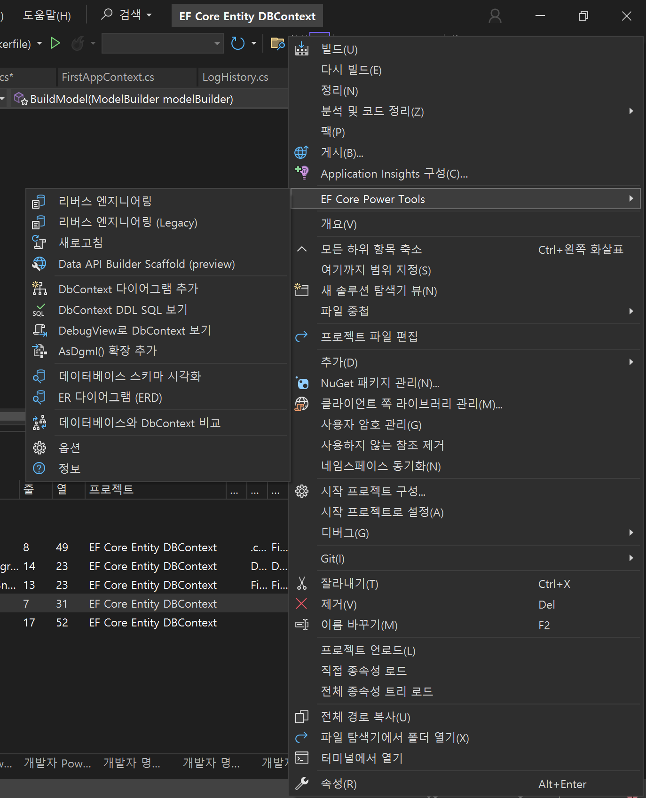

# EF CORE

## Entity Frame Core

[Entity Framework Core](https://docs.microsoft.com/ko-kr/ef/core/) (줄여서 EF Core)는 마이크로소프트에서 개발한 .NET(Core)용 ORM 프레임워크로 [Entity Framework](https://en.wikipedia.org/wiki/Entity_Framework)의 경험으로 새롭게 재개발 되었습니다.

[ORM(Object-relational mapping)](https://en.wikipedia.org/wiki/Object%E2%80%93relational_mapping)을 이용하면 SQL 쿼리를 사용하지 않고 DBMS에 종속적인 코드를 최소화 할 수 있습니다.

EF Core 6에 이르러서 데이터베이스를 마이그레이션하기 위한 별도의 실행형 번들을 지원하고 `ConfigureConventions()` 메소드를 오버라이드 하는 것으로 다양한 관례를 일괄 적용할 수 있는 방법을 제공하며, 컴파일된 모델 지원과 [Dapper](https://github.com/DapperLib/Dapper)에 근접한 성능 및 효율적인 SQL 쿼리 생성 등 많은 개선사항이 포함되었습니다. 이제 EF Core를 이용해 EF Core를 지원하는 DBMS를 이용해 ORM을 충분히 현업에서 사용할 수 있습니다.

이번 장은 콘솔 프로젝트에서 EF Core 개발 환경을 구성하는 방법을 설명합니다.

## **EF Core 패키지 추가**

```csharp
dotnet add package Microsoft.EntityFrameworkCore.Sqlite
dotnet add package Microsoft.EntityFrameworkCore.Design
```

- 마이그레이션 도구 설치

```csharp
dotnet tool install --global dotnet-ef
dotnet tool update --global dotnet-ef

```

- Model Entity 정의

```csharp
using System.ComponentModel.DataAnnotations;

namespace EF_Core_Entity_DBContext.Entities
{
    public class LogHistory
    {
        public LogHistory(string detail)
        {
            this.Detail = detail;   
        }
        [Key]
        public int Seq { get; set; }    
        public string? Detail { get; set; }
        public DateTime CreateTime { get; set; } = DateTime.Now;

        
    }
}

```

- DB context 작성

```csharp
using EF_Core_Entity_DBContext.Entities;
using Microsoft.EntityFrameworkCore;

namespace EF_Core_Entity_DBContext.DbContexts
{
    public class FirstAppContext : DbContext
    {
        public FirstAppContext(DbContextOptions<FirstAppContext> options)
            : base(options) { }

        public DbSet<LogHistory> LogHistories { get; set; }

        protected override void OnModelCreating(ModelBuilder modelBuilder)
        {
            modelBuilder.Entity<LogHistory>()
                        .Property(x => x.Seq)
                        .ValueGeneratedOnAdd();
        }
    }
}

```

### 마이그레이션

EF Core는 도구를 통해 마이그레이션 할 수 있으며 엔터티 및 DB 컨텍스트의 변화를 감지해 변화에 대한 마이그레이션 코드를 자동 생성합니다. 이 정보로 데이터베이스에 업데이트해서 최신의 모델을 데이터베이스 스키마로 적용할 수 있습니다.

```csharp
dotnet ef migrations add first
```

위 명렁을하면 2개의 cs파일이 생성되는데 이때 20220517050233_first.cs 는 현제 스냅샷을 기준으로 변경을 적용할 UP 함수를 제공하고 변경사항을 제거할 Down 함수를 제공하며 FirstAppContextModelSnapshot.cs는 최신 적용된 현재 테이블의 스키마 정보를 표현한 스냅샷으로 현제 DbContext 모델과 스냅샷 모델을 비교하여 차이점을 기반으로 Up ,Down 함수를 제공하는 것이다.

```csharp
//| Migrations/20220517050233_first.cs
using System;
using Microsoft.EntityFrameworkCore.Migrations;

#nullable disable

namespace EFCoreFirstApp.Migrations
{
    public partial class first : Migration
    {
        protected override void Up(MigrationBuilder migrationBuilder)
        {
            migrationBuilder.CreateTable(
                name: "LogHistories",
                columns: table => new
                {
                    Seq = table.Column<int>(type: "INTEGER", nullable: false)
                        .Annotation("Sqlite:Autoincrement", true),
                    Detail = table.Column<string>(type: "TEXT", nullable: false),
                    CreateTime = table.Column<DateTime>(type: "TEXT", nullable: false)
                },
                constraints: table =>
                {
                    table.PrimaryKey("PK_LogHistories", x => x.Seq);
                });
        }

        protected override void Down(MigrationBuilder migrationBuilder)
        {
            migrationBuilder.DropTable(
                name: "LogHistories");
        }
    }

```

```csharp
//FirstAppContextModelSnapshot.cs
// <auto-generated />
using System;
using EF_Core_Entity_DBContext.DbContexts;
using Microsoft.EntityFrameworkCore;
using Microsoft.EntityFrameworkCore.Infrastructure;
using Microsoft.EntityFrameworkCore.Metadata;
using Microsoft.EntityFrameworkCore.Storage.ValueConversion;

#nullable disable

namespace EF_Core_Entity_DBContext.Migrations
{
    [DbContext(typeof(FirstAppContext))]
    partial class FirstAppContextModelSnapshot : ModelSnapshot
    {
        protected override void BuildModel(ModelBuilder modelBuilder)
        {
#pragma warning disable 612, 618
            modelBuilder
                .HasAnnotation("ProductVersion", "9.0.8")
                .HasAnnotation("Relational:MaxIdentifierLength", 128);

            SqlServerModelBuilderExtensions.UseIdentityColumns(modelBuilder);

            modelBuilder.Entity("EF_Core_Entity_DBContext.Entities.LogHistory", b =>
                {
                    b.Property<int>("Seq")
                        .ValueGeneratedOnAdd()
                        .HasColumnType("int");

                    SqlServerPropertyBuilderExtensions.UseIdentityColumn(b.Property<int>("Seq"));

                    b.Property<DateTime>("CreateTime")
                        .HasColumnType("datetime2");

                    b.Property<string>("Detail")
                        .IsRequired()
                        .HasColumnType("nvarchar(max)");

                    b.HasKey("Seq");

                    b.ToTable("LogHistories");
                });
#pragma warning restore 612, 618
        }
    }
}

```

이 정보를 이용해 데이터베이스 스키마에 적용하려면 다음의 명령을 사용합니다.

```csharp
dotnet ef database update
```

위와 같이 실행하면 데이터 베이스가 생성된걸 알 수 있으며 DbContext 상속받은 DB 컨텍스트를 활용하여 사용할 수 있다.

- 위와 같은 방법은 엔티티 클래스  +   DB 변경사항 스냅샷을 통한 추적 및 변경을 사용한 방법이며  흐름은 아래와 같다.

### EF Core 마이그레이션 동작 흐름

1. **`DbContext` 모델 정의**
    - 엔티티 클래스 + Fluent API/Attribute로 DB 설계(스키마) 정의
2. **`Add-Migration` 실행**
    - EF Core는 현재 `DbContext` 모델 상태와 **스냅샷 파일(`ModelSnapshot`)**을 비교
    - 차이점이 있으면 새로운 `Migration` 클래스(`Up`/`Down`) 생성
    - 스냅샷도 최신 상태로 덮어씀
3. **`Update-Database` 실행**
    - `Up()` 메서드를 순서대로 실행해서 DB 스키마 변경 적용

## EF CORE TOOL REVERSE

[Entity Framework Core](https://docs.microsoft.com/ko-kr/ef/core/) (EF Core)는 코드 우선(Code First)뿐만 아니라 **데이터베이스 우선(Database First)** 개발도 지원합니다.

데이터베이스 우선 방식에서는 이미 존재하는 DB 스키마를 기반으로 C# 엔티티 클래스와 `DbContext`를 자동 생성하는 과정을 **Reverse Engineering** 또는 **Scaffolding**이라 부릅니다.

`Scaffold-DbContext` 명령을 사용하면 EF Core에서 지원하는 DBMS의 테이블, 뷰, 관계를 읽어와 대응되는 C# 클래스와 매핑 코드를 자동으로 생성합니다.

- EF Core Reverse Engineering 명령 예시

```csharp
dotnet tool install --global dotnet-ef
dotnet tool update --global dotnet-ef

dotnet ef dbcontext scaffold "Server=localhost;Database=TestDB;User Id=sa;Password=1234;" Microsoft.EntityFrameworkCore.SqlServer -o Models -c TestDbContext -f

```

- **`"연결문자열"`** : 가져올 대상 DB 지정
- **`Microsoft.EntityFrameworkCore.SqlServer`** : DB 제공자(Provider)
- **`o Models`** : 생성된 엔티티 클래스 저장 경로
- **`c TestDbContext`** : 생성될 DbContext 클래스 이름
- **`f`** : 기존 파일 덮어쓰기(Force)

또는 ,  GUI 로 Visual Studio에서 확장으로  EF CORE TOOL 을 설치하여 아래와 같이 진행할 수 있다.




- 생성예시

```csharp
public partial class LogHistory
{
    public int Seq { get; set; }
    public string Detail { get; set; } = null!;
    public DateTime CreateTime { get; set; }
}

```

```csharp
public partial class TestDbContext : DbContext
{
    public TestDbContext(DbContextOptions<TestDbContext> options)
        : base(options)
    {
    }

    public virtual DbSet<LogHistory> LogHistories { get; set; }

    protected override void OnModelCreating(ModelBuilder modelBuilder)
    {
        modelBuilder.Entity<LogHistory>(entity =>
        {
            entity.HasKey(e => e.Seq);
            entity.Property(e => e.Detail).IsRequired();
            entity.Property(e => e.CreateTime).HasColumnType("datetime");
        });
    }
}
```

- Reverse Tool 에서는  DB →  Code 형식이기에 코드기반의 스냅샷 기반의 추적기능으로 변경 사항을 적용하지 않는다.

## 요약

| 구분 | **Migration** | **Reverse Engineering** |
| --- | --- | --- |
| **출발점** | C#의 `DbContext` + 엔티티 클래스(코드) | 기존 데이터베이스(스키마) |
| **목적** | 모델 변경 사항을 DB에 반영 (코드 → DB) | DB 스키마를 기반으로 C# 모델 생성 (DB → 코드) |
| **주요 명령** | `Add-Migration`, `Update-Database` | `Scaffold-DbContext` |
| **결과물** | 마이그레이션 `.cs` 파일 + 스냅샷 파일 | `DbContext` 클래스 + 엔티티 클래스 |
| **동작 방향** | **Code First** | **Database First** |
| **사용 시점** | 이미 C#에서 모델을 설계하고 DB를 생성/갱신하고 싶을 때 | 이미 DB가 있고, 그 DB를 코드에서 사용하고 싶을 때 |
| **변경 반영 방식** | 코드 변경 → `Add-Migration` → DB 변경 | DB 변경 → 다시 `Scaffold-DbContext` 실행 |
- 요약하면, Migration 은 코드 FIrst 기반으로 데이터 베이스에 적용하는 기반이며 , Reverse Engineering 의 경우 DB First 기반으로 코드로 적용하는 기반이다.
- Migraion 기반의 스냅샷을 통한  추적 , 변경 기능도 사실 Reverse Engineering의 경우 스키마 재적용을 통해 업데이트가 가능하다.


`이 두 방법은 사실 닭이 먼저냐 , 알이 먼저냐의 차이일뿐이며  테이블이 결국  복잡해지거나 제약조건이 추가되는 경우  Reverse Engineering이 더 편리한 방법이다.`