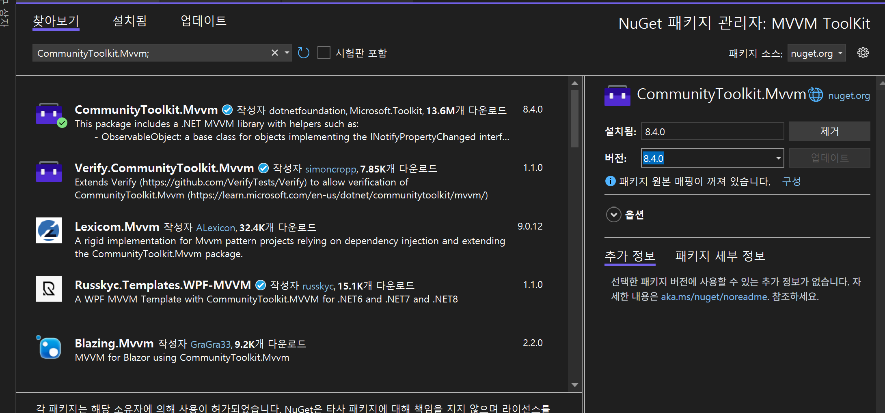

# MVVM TOOLKIT

# **MVVM 도구 키트 소개**

`CommunityToolkit.Mvvm` 패키지(이전의 이름이 MVVM `Microsoft.Toolkit.Mvvm`도구 키트)는 최신의 빠르고 모듈식 MVVM 라이브러리입니다. .NET 커뮤니티 도구 키트의 일부이며 다음 원칙을 기반으로 빌드됩니다.

- **Platform and Runtime Independent.NET - Standard 2.0**, **.NET Standard 2.1** 및 **.NET 6🚀**(UI Framework Agnostic)
- **간편한 선택 및 사용** - 애플리케이션 구조 또는 코딩 패러다임('MVVM'ness 외부)에 대한 엄격한 요구 사항, 즉 유연한 사용법이 없습니다.
- **일품요** 리 - 사용할 구성 요소를 자유롭게 선택할 수 있습니다.
- **참조 구현** - 기본 클래스 라이브러리에 포함되어 있지만 직접 사용할 구체적인 형식이 없는 인터페이스에 대한 구현을 제공하는 Lean 및 performant입니다.



 `CommunityToolkit.Mvvm;` 다운로드 

- 프로젝트 구조

```jsx
WpfMvvmToolkitDemo
 ┣ Models
 ┃ ┗ Person.cs
 ┣ ViewModels
 ┃ ┗ MainViewModel.cs
 ┣ Views
 ┃ ┗ MainWindow.xaml
 ┣ App.xaml / App.xaml.cs
 ┗ WpfMvvmToolkitDemo.csproj

```

대충 비슷하게 구성된다.

- 데이터 클래스 Model

```jsx
namespace WpfMvvmToolkitDemo.Models;

public class Person
{
    public string Name { get; set; } = "";
    public int Age { get; set; }
}
```

- ViewModel

```jsx
using CommunityToolkit.Mvvm.ComponentModel;
using CommunityToolkit.Mvvm.Input;
using System.Collections.ObjectModel;
using WpfMvvmToolkitDemo.Models;

namespace WpfMvvmToolkitDemo.ViewModels;

// MVVM Toolkit의 ObservableObject 상속
public partial class MainViewModel : ObservableObject
{
    // ObservableProperty → 자동으로 Property + INotifyPropertyChanged 구현
    [ObservableProperty]
    private string title = "CommunityToolkit.Mvvm 데모";

    [ObservableProperty]
    private Person? selectedPerson;

    // ObservableCollection → WPF 바인딩 친화적
    public ObservableCollection<Person> People { get; } = new()
    {
        new Person { Name = "홍길동", Age = 25 },
        new Person { Name = "김철수", Age = 30 }
    };

    // RelayCommand → 자동으로 ICommand 구현
    [RelayCommand]
    private void AddPerson()
    {
        People.Add(new Person { Name = "새 인물", Age = 20 });
    }

    [RelayCommand]
    private void RemovePerson()
    {
        if (SelectedPerson != null)
            People.Remove(SelectedPerson);
    }
}
```

## 규칙 하나


- 규칙 , `[ObservableProperty]` 는 속성에 대한 변경 알림을 자동으로 구현해줌 아마 change이벤트 invoke하는 걸 자동으로 해주는듯
- 이 Attribute 를 받은 속성은 Upper로 시작되선 아니한다.


그 이유는 다음과 같다 

`ObservableProperty`  특성을 선언한 속성들은 컴파일 시 Source Generator…를 통해  대응 되는 프로퍼티 Lower{변수} ⇒ UPPER{변수}

```csharp
[ObservableProperty]
// 이렇게 선언하면 
private int count;
```

나만 IIncremental SourceGenerator의 사용방향을 몰랐을뿐.. MS는 잘만 써먹었다..분명히 AOP 금기시한다고 했는데… 

아무튼  컴파일시 OberserverProperty 속성을 선언한 변수는 아래와 같이 변환 된다.

```csharp
public int Count
{
    get => count;
    set
    {
        if (!EqualityComparer<int>.Default.Equals(count, value))
        {
            OnPropertyChanging(value);
            count = value;
            OnPropertyChanged();
            OnCountChanged(value);
        }
    }
```

- 구세대 MVVM에서의 Change 알람 방식

```csharp
   class MainModel : INotifyPropertyChanged
   {
    private int num1 = 1;
    public int Num1
    {
        get { return num1; }
      
    }
      public event PropertyChangedEventHandler PropertyChanged;

  protected void OnPropertyChange(string propertyName)
  {
      PropertyChangedEventHandler handler = PropertyChanged;

      if (handler != null)
      {
          handler(this, new PropertyChangedEventArgs(propertyName));
      }
  }
}
/// 대충 xaml ......
<TextBox text="{Binding Num1 , Mode=TwoWay}">
```

- `ObservableCollection`

컬렉션에 대한 변경을 자동으로 알림을 주어 UI에 자동으로 바인딩 

- `RelayCommand`  `RealyCommand(CanExecute =  nameof(메서드명))`

MVVM에서 버튼 클릭 같은 UI 이벤트를 ViewModel 메서드와 연결해줌 기존의 ICommand 인터페이스 상속받고  Command 객체로 실행할 메서드를 지정하는 구조⇒ RelayCommand를 통해  속성을 받은 메서드는 Command 객체를 자동으로 생성

```csharp
// Command.cs
using System;
using System.Windows.Input;

namespace _1109_MVVM
{
    class Command : ICommand
    {
        Action<object> ExecuteMethod;
        Func<object, bool> CanexecuteMethod;
        

        public Command(Action<object> e, Func<object, bool> c)
        {
            this.ExecuteMethod = e;
            this.CanexecuteMethod = c;
        }
        public Command(Action<object> e )
        {
            this.ExecuteMethod = e;
        }

        public event EventHandler CanExecuteChanged = null;
        public bool CanExecute(object parameter)
        {
            return CanexecuteMethod(parameter);
        }
        
        public void Execute(object parameter)
        {
            ExecuteMethod(parameter);
        }
    }
}
		// MainViewModel
using System;
using System.Collections.Generic;
using System.ComponentModel;
using System.Linq;
using System.Text;
using System.Threading.Tasks;
using _1109_MVVM.Model;
namespace _1109_MVVM.ViewModel
{ // control 의 역할 
    class MainViewModel 
    {
        public MainModel Model { get; set; } // 모델객체를 생성해서 가지고 있음  => 아까 위의 메인 모델 
        // ="{Binding Model.Num1, 이거와 연결되어 바인딩됨 
        // trigger는 WPF 동기화처리때문에   필요없지만  직역하자면  데이터 소스가 수정되었을때의 상황자체를 야기함.
        public Command btn_cmd { get; set; }  // 재활용 객체  특정 버튼이 눌렸을때 재활용할 수 있게 만든 객체 
        // 아래 두개의 함수 delegate를 가지는 객체 
     

        //Command="{Binding btn_cmd}" 이함수를 command와 연동시켜서 command시 바로 안에 있는 두 함수를 실행시킴 
        public MainViewModel()
        {
            Model = new Model.MainModel(); // 어떤 커맨드가 눌리면 
            btn_cmd = new Command(Execute_func, CanExecute_func); // 아래 함수들이 자동으로 호출     CanExcuteFunc 부터 출력 
         
        }        
        private void Execute_func(object obj)
        {
            Model.Num2 = Model.Num1 * 2;
        }
        private bool CanExecute_func(object obj) // 어떤 
        {
            if (Model.Num1 == 100)
                return false;
            return true;
        }
    }
}
// xaml
```

```csharp
using CommunityToolkit.Mvvm.ComponentModel;
using CommunityToolkit.Mvvm.Input;
using MVVM_ToolKit.Model;
using System;
using System.Collections.Generic;
using System.Collections.ObjectModel;
using System.Linq;
using System.Text;
using System.Threading.Tasks;

namespace MVVM_ToolKit.ViewModel
{
    // partal 로선언 - 다른 파일에서 같은 이름의 partial class 를 선언하여 기능을 분리할 수 있다.
    partial class MainViewModel: ObservableObject
    {
        [ObservableProperty]
        // 속성에 대한 변경 알림을 자동으로 구현해줌 
        // 아마 change이벤트 invoke하는 걸 자동으로 해주는듯
        public string title = "TITLE";
        [ObservableProperty]
        public Person? selectedPerson;

        public string? MyStr;

        // ObservableCollection - 컬렉션에 대한 변경 알림을 제공
        //추가되거나 변경되거나 삭제되거나 할때 자동알림
        public ObservableCollection<Person> People { get; } = new()
    {
        new Person { Name = "홍길동", Age = 25 },
        new Person { Name = "김철수", Age = 30 }
    };
        // ObervableCollection<Person> 로 생성시 자동으로 INotifyCollectionChanged 구현   

        [RelayCommand]
        private void AddPerson()
        {
            People.Add(new Person { Name = "새로운 사람", Age = 20 });
        }
        // RelayCommand - ICommand 인터페이스 구현을 자동으로 해줌

        [RelayCommand(CanExecute = nameof(CanRemovePerson))]
        // CanExecute 속성으로 명령이 실행될 수 있는지 여부를 결정하는 메서드 지정    
        private void RemovePerson()
        {
            if (SelectedPerson != null)
            {
                People.Remove(SelectedPerson);
            }
        }
        private bool CanRemovePerson()=> SelectedPerson != null;

    }
}
//...xaml
<Window x:Class="MVVM_ToolKit.MainWindow"
        xmlns="http://schemas.microsoft.com/winfx/2006/xaml/presentation"
        xmlns:x="http://schemas.microsoft.com/winfx/2006/xaml"
        xmlns:vm="clr-namespace:MVVM_ToolKit.ViewModel"
        Title="MVVM Toolkit Demo" Height="300" Width="400">

    <Window.DataContext>
        <vm:MainViewModel/>
    </Window.DataContext>

    <DockPanel Margin="10">
        <StackPanel DockPanel.Dock="Top" Orientation="Horizontal" Margin="0 0 0 10">
            <TextBox Width="100" Margin="0 0 10 0"
                     Text="{Binding NewPersonName}"
                     ></TextBox>
            
            <Button Content="추가" Command="{Binding AddPersonCommand}" Margin="0 0 10 0"/>
            <Button Content="삭제" Command="{Binding RemovePersonCommand}"/>
        </StackPanel>

        <ListBox ItemsSource="{Binding People}" 
                 SelectedItem="{Binding SelectedPerson}" 
             
                
                 Selected="ListBox_Selected"
                 DisplayMemberPath="Name" Height="180"/>

        <TextBlock Text="{Binding Title}" 
                   FontSize="16" 
                   HorizontalAlignment="Center" 
                   Margin="0 10 0 0"/>
    </DockPanel>
</Window>

```

MVVM ToolKit으로 간단하게 바인딩이 가능하며 

## DI 주입  (HostBuilder)

```csharp
// mainWindows.xaml

    <Window.DataContext>
        <vm:MainViewModel/>
    </Window.DataContext>
```

View에서  네임스페이스로 지정한 vm에 DataContext로 MainViewModel을  참조하도록 하는 구조에서 

App에서의 DI 주입으로 간단하게 설정이 가능하다.


```csharp
using Microsoft.Extensions.DependencyInjection;
using Microsoft.Extensions.Hosting;
using MVVM_ToolKit.ViewModel;
using System.Configuration;
using System.Data;
using System.Windows;
namespace MVVM_ToolKit
{
    /// <summary>
    /// Interaction logic for App.xaml
    /// </summary>
    public partial class App : Application
    {
        private IHost? _host;       
        protected override void OnStartup(StartupEventArgs e)
        {
            _host = Host.CreateDefaultBuilder()
            .ConfigureServices(s =>
            {
                // DI 등록
                s.AddSingleton<MainViewModel>(); //프로그램에서 하나만 존재하는 MainViewModel 등록
                s.AddSingleton<MainWindow>(); // 메인 윈도우는 앱 생명주기 동안 딱 하나만 사용
            })
            .Build();

            var main = _host.Services.GetRequiredService<MainWindow>(); // 서비스 컨테이너에서 MainWindow 인스턴스 가져오기
            // 해당 시점에서 WPF 창이 생성
            main.DataContext = _host.Services.GetRequiredService<MainViewModel>();
            // MainViewModel 인스턴스를 DataContext로  컨테이너에서 꺼내서 주입
           
            main.Show();

            base.OnStartup(e);
        }

    }

}

```

아래와 같이 주입하고 XAML에서 DataContext를 지우고 사용이 가능하다.